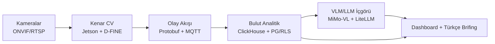

# WherUGo

  

**WherUGo, mağazanızın mevcut CCTV kameralarını satış artıran bir davranış analitiği platformuna dönüştürür.** Kenar (edge) cihazda çalışan bilgisayarlı görü, müşteri yolculuğunu anonim metrik olarak ölçer; VLM/LLM katmanı bu metrikleri her sabah Türkçe bir yönetici brifingine çevirir. Video mağazayı asla terk etmez.

Dijital mağazaların yıllardır kullandığı funnel analitiği — *geçen → giren → bölgeye uğrayan → ilgilenen → satın alan* — fiziksel mağazaya taşınır. Sektör verileri net: dwell time'da %1 artış satışta ~%1,3 artış demektir; trafik-bazlı vardiya planlaması dönüşümü +%4,5 iyileştirir.

## Değer Önerisi

1. **Donanımsız giriş:** Mevcut ONVIF/RTSP kameralar yeniden kullanılır; girişlere yalnızca 1–2 top-down dome (~$130/adet) eklenir. Sensör CAPEX'i yok, hızlı POC.
2. **Denetlenebilir doğruluk:** Her metrik `quality` alanı ve veri kalite rozetiyle gelir; "veri yok" asla "müşteri yok" sayılmaz (`coverage_gaps` tablosu). Doğruluk iddiası pazarlama değil, sözleşmeye yazılabilir bir garanti.
3. **KVKK-native gizlilik:** Anonimleştirme kenar cihazda; buluta yalnız metadata gider (~2.000× bant tasarrufu). Gizlilik, sonradan eklenen bir özellik değil şema düzeyinde bir imkânsızlıktır.

## Sistem Nasıl Çalışır?

1. **Görüntü işleme mağazada kalır:** Jetson Orin üzerinde D-FINE (Apache-2.0) tespiti + ByteTrack takibi, 8–12 kamerayı @10 FPS işler.
2. **Olaylar anonim metriğe dönüşür:** Zone enter/exit, dwell, kuyruk katılım/terk olayları Protobuf zarfıyla üretilir — piksel alanı şemada yoktur.
3. **Güvenli akış:** Mosquitto (store-and-forward) → mTLS → EMQX → ClickHouse; kesintide sıfır veri kaybı, `event_id` ile çift sayım yok.
4. **Analitik motor:** ClickHouse rollup'ları footfall, dwell p50/p95, kuyruk ve dönüşüm metriklerini üretir; k<10 hücre bastırma gateway'de zorunludur.
5. **İçgörü katmanı:** MiMo-VL-7B (on-prem) belirsiz olayları hakem olarak yorumlar; Claude Haiku 4.5 / Gemini Flash günlük Türkçe brifingi yazar — her sayısal iddiaya kaynak metrik ID'si iliştirilir.



## Temel Özellikler

- Footfall, occupancy ve POS-bağlı **gerçek dönüşüm oranı** (staff-excluded)
- Zone traffic + dwell time; **üç heatmap**: yoğunluk, dwell, akış
- **Kuyruk zekâsı:** bekleme süresi, kuyruk terki, gerçek zamanlı "kasa aç" alarmı
- Tam mağaza funnel'ı ve path/first-destination analizi (Faz 2)
- Planogram A/B testi (diff-in-diff) ve agregat çalışan-müşteri etkileşim metrikleri
- **Veri kalite rozeti** (yeşil/sarı/kırmızı) ve kalibrasyonlu güven aralıkları
- AI günlük brifing: teşhis + aksiyon önerisi + kaynak metrik referansı

> ### 🔒 Gizlilik Taahhüdümüz
> - **Yüz tanıma, duygu ve demografi analizi yoktur** — ürün politikasıyla kapsam dışıdır (KVKK Kurul kararı 2022/797, EU AI Act Art. 5 uyumlu).
> - **Video buluta asla gitmez** — yalnız anonim metadata; Protobuf şemasında piksel alanı yoktur.
> - **KVKK uyumlu tasarım:** k<10 bastırma, 90 gün TTL + otomatik imha, çalışan verisi yalnız vardiya/mağaza agregatı, katmanlı aydınlatma kiti ve DPA şablonları pakete dahildir.

## Doküman Haritası

| Doküman | İçerik |
|---|---|
| [docs/01](docs/01-vizyon-ve-kapsam.md) | Ürün vizyonu, hedef segmentler, personalar, kullanım senaryoları ve kapsam dışı maddeler |
| [docs/02](docs/02-sistem-mimarisi.md) | Katman katman sistem mimarisi, olay şeması ve nihai teknoloji kararları |
| [docs/03](docs/03-ai-model-katmani.md) | İki seviyeli AI katmanı: kenar CV pipeline modelleri + MiMo-VL/LLM içgörü katmanı |
| [docs/04](docs/04-analitik-ve-metrikler.md) | Metrik kataloğu, dashboard tasarımı, AI haftalık rapor örneği ve doğruluk raporlama |
| [docs/05](docs/05-gizlilik-ve-uyum.md) | Gizlilik mimarisi (privacy by design), KVKK/GDPR uyum kontrol listesi |
| [docs/06](docs/06-donanim-ve-altyapi.md) | Kamera/kenar cihaz reçeteleri, kurulum-kalibrasyon, bant genişliği ve maliyet modeli |
| [docs/07](docs/07-yol-haritasi.md) | Faz planı (PoC → Pilot → 10 → 100+ mağaza), kapı kriterleri ve ekip ihtiyacı |
| [docs/08](docs/08-riskler-ve-acik-sorular.md) | Risk kaydı, açık sorular ve varsayımların test planı |
| [docs/09](docs/09-inovasyon-fikirleri.md) | Farklılaştırıcı ürün fikirleri (jüri süzgecinden geçmiş 15 fikir, faz etiketli) |

---

## Hızlı Başlangıç

```bash
make install   # tek venv'e üç paketi kurar
make test      # tüm test paketleri (ai + backend + edge)
make demo      # backend :8000 + hızlandırılmış mağaza simülatörü
               # → http://localhost:8000 (dashboard, ~1 dk içinde canlı veri)
make demo-stop # demoyu durdurur

# veya Docker ile:
docker compose -f deploy/docker-compose.yml up --build
```

Gerçek kamera sahasında `edge` paketi `--source video` ile (ultralytics/OpenCV, `pip install -e "edge[cv]"`) RTSP akışlarına bağlanır; simülatör ile aynı olay sözleşmesini üretir. AI brifingi varsayılan olarak anahtarsız MockProvider ile çalışır; `WHERUGO_LLM_PROVIDER=openai` + `WHERUGO_LLM_BASE_URL` ile MiMo/vLLM'e, `WHERUGO_LLM_PROVIDER=anthropic` ile Claude'a bağlanır (`CONTRACTS.md` §5).

---

**Proje durumu:** 🟢 **Çalışan MVP** — uçtan uca zincir (simülatör → kenar olay motoru → ingest → analitik → dashboard → AI brifing) testli ve çalışır durumda; saha pilotu için donanım/kurulum yol haritası `docs/07`'de. Katkı ve geri bildirim için: emres@biscozum.com.tr
