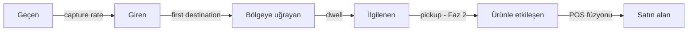

# 1. Vizyon ve Kapsam

## 1.1 Ürün Vizyonu

**WherUGo**, perakendecinin halihazırda tavanında asılı duran ONVIF/RTSP güvenlik kameralarını — ek donanım CAPEX'i olmadan — mağaza içi davranış analitiği platformuna dönüştürür. E-ticaretin yıllardır sahip olduğu funnel görünürlüğünü (`geçen → giren → bölgeye uğrayan → ilgilenen → satın alan`) fiziksel mağazaya taşır ve bunu **KVKK-native** bir mimariyle yapar: video mağazayı asla terk etmez, buluta yalnız anonim metadata gider (~2.000× bant tasarrufu), yüz tanıma ve bireysel kimliklendirme şema düzeyinde imkânsızdır.

Vizyon cümlesi: *"Türkiye'nin, doğruluğunu kanıtlayabilen ve gizliliği ürün özelliği olarak satan tek mağaza içi analitik platformu olmak."*

Farklılaştırıcımız üç sütundur:

1. **Donanımsız giriş:** V-Count/RetailNext sensör CAPEX'ine ($800–2.000/sensör) karşı mevcut CCTV yeniden kullanımı; yalnız girişlere zorunlu top-down dome (~$130/adet).
2. **Denetlenebilir doğruluk:** Her metrikte kalite rozeti (yeşil/sarı/kırmızı), `coverage_gaps` takibiyle "veri yok ≠ müşteri yok" garantisi, Faz 2'de güven aralıklı raporlama ("dwell %12 ± 4 arttı"). Sahte hassasiyet satılmaz.
3. **₺ dili:** Her metrik ciro etkisine çevrilir — dwell time'da %1 artış satışta %1,3 artış demektir (Pathintelligence); kuyruk terki "sabırsızlığa kaybedilen ciro" olarak raporlanır.

## 1.2 Çözülen Problem

Türkiye'de fiziksel perakendeci mağazasını kör uçuyor: POS *ne satıldığını* söylüyor, ama **kaç kişinin girdiğini, nereye gittiğini, neye bakıp almadan çıktığını, kuyrukta kaç kişinin sepeti bırakıp gittiğini** söyleyemiyor. Küresel oyuncular (RetailNext, V-Count) sensör donanımı dayatıyor; yerli oyuncular parçalı (Via-Vis yalnız sayım, Vispera yalnız raf tanıma). **Trafik + zone + kuyruk + çalışan etkileşimi + planogram A/B'sini tek platformda sunan, KVKK-native yerli oyuncu yok.** WherUGo bu boşluğu dolduruyor.

## 1.3 Hedef Müşteri Segmentleri

| Segment | Profil | Öncelikli değer | Fiyat modeli | Faz |
|---|---|---|---|---|
| **Butik / bağımsız** (1–5 mağaza) | Moda, kozmetik, elektronik; 4–12 kamera/mağaza | Dönüşüm oranı, vitrin etkinliği, kuyruk alarmı | Kamera-başı/ay SaaS (~$15–40 TR bandı) | Pilot (Faz 0–1) |
| **Zincir** (10–500 mağaza) | Ulusal moda/market zincirleri, franchise ağları | Mağazalar arası benchmark, lig tablosu, planogram A/B, API/webhook | Kamera-başı + mağaza-başı platform ücreti; Keycloak SSO | Faz 2–3 |
| **AVM işletmecisi** | Ortak alan + kiracı performansı | Occupancy, kat/koridor akışı, kiracıya capture rate raporu | Lokasyon-başı platform + kiracı-başı modül | Faz 3 |

## 1.4 Kullanıcı Personaları

| Persona | İhtiyaç | WherUGo görünümü | Faz |
|---|---|---|---|
| **Mağaza Müdürü** (pilot personası) | "Şimdi ne yapmalıyım?" — bugünkü trafik vs tahmin, anlık kuyruk alarmı, vardiya-trafik uyumu | Operasyonel dashboard + gerçek zamanlı alarm + günlük Türkçe AI brifingi (Ay 4–6'dan itibaren) | Faz 0–1 |
| **Bölge Müdürü** | Mağazalar arası kıyas, outlier tespiti, controllable execution takibi | Benchmark/lig tablosu, haftalık trend, dönüşüm karşılaştırması | Faz 2 |
| **Merchandising Uzmanı** | Zone/kategori funnel'ı, yerleşim etkinliği, A/B sonuçları | Üç heatmap (yoğunluk/dwell/akış), diff-in-diff A/B modülü, kategori komşuluğu | Faz 2 |
| **Franchise Sahibi** | Yatırımının getirisi; birden çok bayinin özet performansı | Salt-okunur özet görünüm, aylık PDF rapor, ROI paneli | Faz 2 |

Pilot bilinçli olarak **tek personaya** (mağaza müdürü) odaklanır; diğer görünümler Faz 2 kapısının arkasındadır.

## 1.5 Temel Kullanım Senaryoları

1. **İlk durak (first destination) analizi:** Girişten sonra ilk gidilen bölge ve decompression zone (kapıdan sonraki 3–5 m) yığılma tespiti; giriş düzeni tasarım hatalarını ortaya çıkarır.
2. **Ölü bölge tespiti:** Yoğunluk heatmap'inde trafiği düşük kalan zone'lar + "atlanan bölüm" path analizi; kira maliyeti taşıyan ama ciro üretmeyen metrekarelerin teşhisi. "Trafik yok" (konum sorunu) ile "trafik var ama satış yok" (yerleşim/fiyat sorunu) ayrımı POS füzyonuyla yapılır.
3. **Vitrin etkinliği:** Pass-by trafik ve capture rate ölçümü; vitrin değişikliği öncesi/sonrası karşılaştırma.
4. **Kampanya / yerleşim A/B testi:** "Öncesi 2 hafta / sonrası 2 hafta, kontrol mağazalı diff-in-diff" protokolü; zone traffic + dwell + POS satışı birlikte ölçülür. Sektör benchmark'ı: planogram optimizasyonu kategori satışını %12–20 artırabilir.
5. **Kuyruk yönetimi:** Gerçek zamanlı kuyruk uzunluğu + bekleme süresi (p95) + eşik aşımında "kasa aç" alarmı; POS'un göremediği **kuyruk terkini** (queue abandonment) tespit edip kaybedilen ciroyu ₺ olarak raporlar. Benchmark: 5 dakikadan uzun bekleyen müşteride terk olasılığı belirgin artar.
6. **Personel planlaması (yalnız agregat):** Trafik-bazlı vardiya önerisi (dönüşümde +%4,5 kanıtı), agregat yardım oranı ve servis kör noktaları. INFORMS bulgusu: yardım oranı %50→%60 = dönüşüm +5 puan. Kişi-bazlı performans skoru **asla** üretilmez (KVKK duyurusu: kameralar çalışan performans takibi için kullanılamaz).
7. **Ürün yerleşim optimizasyonu:** Raf önü dwell + (Faz 2'de) pickup/putback ile "altın raf" (91–152 cm) etkinliği; kategori komşuluğu önerileri.
8. **Kayıp önleme — SINIR:** WherUGo agregat anomali sinyali verebilir (olağandışı dwell deseni, kör bölge yoğunluğu) ama **şüpheli kişi işaretleme, bireysel takip, yüz eşleştirme veya güvenlik müdahale tetikleme YAPMAZ**. Kayıp önleme ayrı bir güvenlik ürünüdür; biz analitik ürünüyüz. Amazon JWO dersi: birey-düzeyi hassasiyet peşinde koşan sistemler sürdürülemez maliyete koşar; agregat analitik kat kat ucuz ve satılabilirdir.

## 1.6 Kapsam Dışı (kalıcı ürün politikası)

- **Yüz tanıma YOK, duygu/demografi analizi YOK** — Kurul kararı 2022/797 ve EU AI Act Art. 5 gereği; Protobuf şemasında piksel alanı dahi yoktur.
- **Bireysel kimliklendirme YOK:** Günler-arası re-ID yapılmaz; ReID embedding'leri yalnız RAM/şifreli geçici depoda, ziyaret sonunda crypto-shredding. Çalışan verisi yalnız vardiya/mağaza agregatı; DB'de bireysel çalışan tablosu yok. Dashboard'a k<10 hücre bastırmayla tekil müşteri sızamaz.
- **Ödeme/işlem takibi YOK:** POS entegrasyonu yalnız günlük agregat import'tur (`pos_daily`: işlem sayısı, ciro); kart, fiş satırı, müşteri kimliği işlenmez.
- **Otonom kasa (Just Walk Out) hedefi YOK**, ses kaydı YOK (mikrofonsuz şartname), mahrem alanlarda izleme YOK (kurulum sihirbazında zorunlu maske adımı).

## 1.7 Başarı Kriterleri

**Pilot (Ay 0–6, Faz 2 kapı kriterleri):**

| Kriter | Hedef |
|---|---|
| Giriş sayım doğruluğu (ground-truth "sayım günü"ne karşı) | ≥ %90 (tutmazsa top-down dome fallback) |
| Dwell time MAPE | ≤ %15 |
| Ölçülebilir müdahale | ≥ 2 pozitif sonuç (kuyruk alarmı → kasa açma; raf değişikliği diff-in-diff) |
| Ticari doğrulama | Ücretli devam LOI'si |
| VLM klip sınıflandırma (Ay 4–6) | 200 klipte insan etiketiyle A/B |

**Ürün/işletme (Faz 2+):** 10 mağazada kaos testi suite'i yeşil (48 saat kesintide sıfır olay kaybı, çift sayım yok); cross-camera eşleştirme kesinliği ≥ %80 (altındaysa kamera-yerel kalınır); VLM-insan uyumu Cohen's kappa > 0.75; kalite rozeti yeşil oranı ≥ %95; müşteri tarafında en az bir "%X ± Y" formatlı, sözleşmeye yazılabilir doğruluk iddiası.

Başarının nihai tanımı: mağaza müdürünün her sabah dashboard'u kendiliğinden açması — çünkü orada "satış düştü" değil, **"nerede sızıntı var ve bugün ne yapmalısın"** yazıyor.
