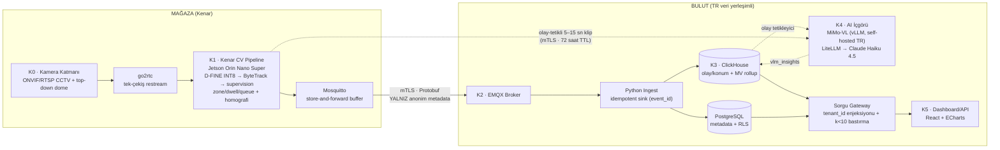

# Sistem Mimarisi

## 1. Uçtan Uca Genel Görünüm

WherUGo mimarisi altı katman ve iki çapraz düzlemden oluşur. Temel ilke: **ham video mağazayı asla terk etmez** — buluta sürekli akan tek şey anonim, Protobuf ile sözleşmelenmiş metadata'dır (~2.000× bant tasarrufu). Tek kontrollü istisna: düşük güvenli olaylar için 5–15 sn doğrulama klipleri, yalnız **kendi kontrolümüzdeki TR veri yerleşimli VLM sunucusuna** mTLS ile gider ve 72 saat TTL ile silinir; hiçbir üçüncü tarafa veya ticari API'ye gitmez. Pahalı-değiştirilen kararlar (olay sözleşmesi, RLS + gateway izolasyonu, kalite alanlı şema) gün 1'de kurulur; pahalı-işletilen bileşenler (Kafka, K8s, VLM cascade) faz kapılarının arkasındadır.



Çapraz düzlemler: **Gizlilik** (şema düzeyinde imkânsızlık — Protobuf'ta piksel alanı yok, DB'de bireysel çalışan tablosu yok) ve **Kalite/Kalibrasyon** (her olayda `quality` alt-nesnesi, `coverage_gaps` tablosu, kamera başına yeniden projeksiyon hatası kaydı).

## 2. Katmanlar ve Teknoloji Kararları

### K0 — Kamera Katmanı

Birincil yol mevcut ONVIF/RTSP CCTV'nin yeniden kullanımıdır (CAPEX ≈ sıfır); girişlere 1–2 adet top-down dome (~$130/adet) pilotta zorunludur — giriş sayımı POS-dönüşüm metriğinin temelidir ve açılı kameraya emanet edilmez. Kurulumda kamera başına ~15 dakikalık 4-noktalı zemin homografisi çıkarılır ve **yeniden projeksiyon hatası (cm) kamera metadata'sına yazılır**; bu tek alan ileride tüm belirsizlik hesabının tabanıdır. Mahrem alan maskeleri kurulum sihirbazında zorunlu adımdır; mikrofonsuz şartname geçerlidir.

### K1 — Kenar CV Pipeline

Pilot donanımı **Jetson Orin Nano Super** (67 TOPS, $249 dev kit — 8–12 kamera @10 FPS), Faz 2 standart kutusu **Orin NX 16GB**. Akış: go2rtc tek-çekiş restream (substream tespite, full-res doğrulama klibine) → Frigate tarzı motion gating (kapasite 2–5×) → **D-FINE-S/L INT8 TensorRT** tespit → **ByteTrack** takip → homografi ile plan koordinatı → **supervision** ile zone/dwell/queue mantığı. Zone mantığının supervision ile framework-bağımsız yazılması bilinçli bir karardır: ne DeepStream'e ne NVIDIA'ya kilitlenme vardır; Faz 3'te Intel/OpenVINO ikinci donanım hedefi aynı iş mantığıyla açılır. Her olaya gün 1'den `quality{conf, occlusion_ratio, coverage_ok}` eklenir; günlük sahne sağlık kontrolü (blur/açı/aydınlatma, homografi drift bayrağı) çalışır. Cross-camera ReID pilotta **kapalıdır** — Faz 2'de DPIA onayı ve ≥%80 eşleştirme kesinliği şartıyla BoT-SORT-ReID + OSNet-x0.25 eklenir. Kenar cihaz VLM çıkarımı yapmaz — 7B VLM yükü kenar donanımının kapasitesinin dışındadır; doğrulama klipleri olay-tetikli olarak buluttaki VLM sunucusuna gönderilir.

### K2 — Olay Veri Yolu (mimarinin kalbi)

Tüm olaylar gün 1'den **Protobuf** ile tanımlanır. Evrim kuralı katıdır: alan ekleme serbest, silme/yeniden numaralama yasak; bulut tüketicileri N ve N-2 şema sürümlerini aynı anda okur. Taşıma fazlıdır: pilotta kenar tarafında **Mosquitto** (bağlantı kopuşuna dayanıklı store-and-forward), mTLS üzerinden bulutta tek **EMQX**, ince Python ingest ve ClickHouse. **Kafka pilotta yoktur** — <50 MB/gün trafik için saf işletme yüküdür; 10+ mağazada EMQX ile ClickHouse arasına girer ve Protobuf sözleşmesi sayesinde bu ekleme üreticiler için görünmezdir. Doğruluk garantileri gün 1'den: at-least-once teslimat + `event_id` ile idempotent yazım (çift sayım yok), dakikalık heartbeat + `seq_no` boşluk tespiti → `coverage_gaps` tablosu. "Veri yok" ile "müşteri yok" hiçbir fazda karıştırılmaz.

### K3 — Bulut Analitik

**ClickHouse** (agregasyonda 6–7× hız, 10–20× sıkıştırma, Apache-2.0) olay/konum deposu; **PostgreSQL** tenant/mağaza/kamera/zone metadata'sı. Ham `track_positions` 90 gün TTL'lidir; saatlik/günlük materialized view rollup'ları (`zone_hourly`, `queue_hourly`) süresiz saklanır. `calibration_run` tablosu gün 1'de şemada vardır, Faz 2'de kalibrasyon verisi biriktikçe dolar. Barındırma pilotta TR veri yerleşimli sağlayıcıda tek VM, Faz 3'te managed ClickHouse/K8s.

### K4 — AI İçgörü Katmanı

**MiMo-VL-7B-RL-2508** (MIT), kendi kontrolümüzdeki **TR veri yerleşimli GPU sunucusunda self-hosted vLLM** üzerinde, üç rolde: (1) olay-tetikli sahne hakemi — düşük güvenli olaylar için 5–15 sn klip → yapılandırılmış İngilizce JSON (`/no_think` hızlı sınıflandırma, thinking mode anomali açıklaması); (2) ground-truth ön-etiketleyici (insan anotasyonunu 5–10× hızlandırır); (3) anomali ön-açıklaması (Faz 2). VLM asla gerçek zamanlı takip yapmaz — CV pipeline'ın ürettiği olayların yorumcusudur. Türkçe günlük brifing **Claude Haiku 4.5 / Gemini Flash** batch işidir (girdi yalnız metrik + MiMo'nun İngilizce JSON'ları; ~$0,15–0,60/gün/mağaza). Tüm modeller self-hosted **LiteLLM** çatısı altındadır; Qwen3-VL-8B kalıcı A/B adayıdır. Korkuluklar: `vlm_verdict` insan onayı olmadan ground-truth sayılmaz, klipler yalnız kendi kontrolümüzdeki TR sunucuda işlenir ve 72 saat TTL ile silinir, ham klip hiçbir ticari API'ye veya üçüncü tarafa gitmez.

### K5 — Sunum Katmanı

**Custom React + ECharts**, mağaza planı (SVG) üzerine ısı haritası overlay; deck.gl Faz 2. Grafana embed reddedilmiştir (AGPL + zayıf multi-tenant embed). Her metrik yanında **veri kalite rozeti** gün 1'den vardır: yeşil (kalibre + tam kapsam), sarı (kapsam boşluğu düzeltildi), kırmızı (kalibrasyon süresi dolmuş). Güven aralıklı "%12 ± 4" dili Faz 2'de, GA hesabı gerçekten yapılınca açılır — sahte hassasiyet satılmaz.

### Teknoloji Seçimi ve Gerekçe Tablosu

| Bileşen | Seçim | Lisans | Gerekçe |
|---|---|---|---|
| Tespit | D-FINE-S/L INT8 TensorRT | Apache-2.0 | 54.0 AP, T4'te ~8 ms; AGPL'li Ultralytics YOLO ve non-commercial YOLO-NAS yasak listesinde |
| Takip | ByteTrack (supervision) | MIT | Kamera-içi metrikler için yeterli; BoxMOT (AGPL) kullanılmaz; Faz 2'de BoT-SORT-ReID orijinal MIT repolardan |
| Zone/dwell/queue | supervision | MIT | Framework-bağımsız; DeepStream/NVIDIA kilitlenmesi yok |
| Kenar donanım | Orin Nano Super → Orin NX 16GB | — | $249'a 8–12 kamera @10 FPS; NX Faz 2 standart kutusu (157 TOPS) |
| Restream | go2rtc | MIT | Kameradan tek çekiş; substream tespite, full-res klibe |
| Kenar broker | Mosquitto | EPL/EDL | Hafif store-and-forward; kesintide veri kaybı yok |
| Bulut broker | EMQX | BSL 1.1 | mTLS, cihaz filo ölçeğinde MQTT; Kafka 10+ mağaza kapısında |
| Olay formatı | Protobuf + şema versiyonlama | — | Geriye-uyumlu evrim; 500 mağazada kırılmayan sözleşme; sonradan eklenmesi imkânsıza yakın |
| Analitik DB | ClickHouse | Apache-2.0 | Agregasyonda 6–7× hız, 10–20× sıkıştırma; TimescaleDB TSL engeli yok |
| Metadata DB | PostgreSQL + RLS | PostgreSQL | Tenant izolasyonu DB seviyesinde; gateway ile çift katman |
| VLM | MiMo-VL-7B-RL-2508 (vLLM) | MIT | Self-hosted, kendi TR sunucumuzda; klip ticari API'lere/üçüncü taraflara çıkmaz; /no_think + thinking mode ikiliği |
| LLM (Türkçe) | Claude Haiku 4.5 / Gemini Flash | ticari API | Türkçe MiMo'ya emanet edilmez; yalnız metin/metrik gider; model kademelendirme 100+ mağazada ~$1M/yıl fark |
| LLM soyutlama | LiteLLM (self-hosted) | MIT | vLLM + bulut API tek çatı; A/B ve failover |
| Dashboard | React + ECharts | Apache-2.0 | Grafana AGPL + zayıf embed; müşteri kroki üstünde ürün ister |

## 3. Veri Akış Şeması

```mermaid
sequenceDiagram
    participant C as Kamera (RTSP)
    participant E as Kenar CV (Jetson)
    participant M as Mosquitto (buffer)
    participant X as EMQX (bulut)
    participant I as Ingest (idempotent)
    participant CH as ClickHouse
    participant V as MiMo-VL (self-hosted, TR)
    participant GW as Gateway
    participant D as Dashboard

    C->>E: substream (tespit) + full-res (klip)
    E->>E: D-FINE → ByteTrack → homografi → zone mantığı
    E->>M: Protobuf olay (zarf: seq_no, event_id, schema_version)
    Note over M: Bağlantı kopsa da diske yazar,<br/>dönünce sırayla boşaltır
    M->>X: mTLS · batch · sıkıştırılmış
    X->>I: tüketim (N ve N-2 şema)
    I->>CH: event_id ile idempotent INSERT
    I->>CH: seq_no boşluğu → coverage_gaps
    CH-->>V: düşük güvenli olay tetiği
    E-->>V: 5–15 sn klip (mTLS, yalnız kendi TR sunucumuza, 72s TTL)
    V->>CH: vlm_verdict + vlm_conf (öneri statüsünde)
    D->>GW: JWT ile sorgu
    GW->>CH: tenant_id enjeksiyonu + k&lt;10 bastırma
    GW->>D: metrik + kalite rozeti + gap düzeltme bayrağı
```

## 4. Kenar–Bulut Sözleşmesi: Buluta Ne Akar, Ne Akmaz

| Buluta AKAR (yalnız anonim metadata + kontrollü klip istisnası) | Buluta ASLA AKMAZ |
|---|---|
| Plan koordinatları (x, y, cm cinsinden sigma) | Ham video / sürekli piksel akışı |
| Zone olayları (enter/exit/dwell/queue) | Yüz, biyometri, demografi, duygu |
| Oturum-yerel `track_id` (ziyaret sonunda anlamsızlaşır) | ReID embedding'leri (yalnız kenarda RAM/şifreli geçici depo, ziyaret sonunda crypto-shredding) |
| Kalite/kapsam metadata'sı, heartbeat, cihaz sağlığı | Bireysel çalışan performans verisi (yalnız vardiya/mağaza agregatı) |
| MiMo'nun yapılandırılmış JSON çıktıları (metin) | Kliplerin herhangi bir ticari API'ye veya üçüncü tarafa aktarımı |
| Kontrollü istisna: düşük güvenli olaylarda 5–15 sn doğrulama klipleri (yalnız kendi TR VLM sunucumuz, 72 saat TTL) | |

Metadata yolunda bu ayrım politika değil **şema düzeyinde imkânsızlıktır**: Protobuf tanımlarında görüntü taşıyabilecek alan yoktur. Doğrulama klipleri olay veri yolundan tamamen ayrı, mTLS'li özel bir kanaldan yalnız kendi kontrolümüzdeki TR veri yerleşimli VLM sunucusuna gider ve 72 saat TTL sonunda silinir. 20 kameralı mağazada olay trafiği <0,1 Mbps, yalnız zone olaylarıyla <50 MB/gün — videonun sürekli buluta akmasına kıyasla ~2.000× tasarruf.

**Protobuf zarfı (tüm olay tiplerinde zorunlu):** `tenant_id, store_id, device_id, schema_version, seq_no, event_id (UUID), event_time, ingest_time`.

## 5. Multi-Tenant Yapı

Hiyerarşi: `tenant → (region, Faz 2) → store → edge_device → camera → zone`. İzolasyon üç kattadır ve **pilotta tek tenant'ken bile açıktır** — retrofit maliyeti felakettir, gün-1 maliyeti sıfıra yakındır:

1. **Sorgu gateway'i:** `tenant_id` filtresi uygulama koduna değil gateway'e enjekte edilir; JWT'deki tenant claim'i her ClickHouse/PG sorgusuna zorunlu predicate olarak eklenir. k<10 hücre bastırma da burada uygulanır — dashboard'a tekil müşteri sızamaz.
2. **PostgreSQL RLS:** gateway atlanamasa bile satır düzeyi ikinci savunma hattı.
3. **İzolasyon tier'ı:** `tenant.isolation_tier` alanı gün 1'de şemadadır; Faz 3'te enterprise müşteriler için ayrı DB/cluster fiyat kademesi olarak açılır.

Kenar cihazlar mTLS istemci sertifikalarıyla tenant'a bağlanır; EMQX topic yapısı `t/{tenant_id}/{store_id}/{device_id}/events` deseniyle broker seviyesinde de izolasyon sağlar.

## 6. Olay Şeması (JSON Temsili)

Tel üzerindeki format Protobuf'tur; aşağıdaki JSON'lar okunabilirlik içindir. Zarf alanları her mesajda tekrarlanır (kısaltılmış gösterim).

```jsonc
// track_update — 1 Hz konum akışı (track_positions, TTL 90 gün)
{
  "envelope": { "tenant_id": "t_arma", "store_id": 12, "device_id": "edge-12a",
    "schema_version": 3, "seq_no": 481207, "event_id": "5f1c…", 
    "event_time": "2026-07-07T14:03:22.150Z", "ingest_time": "2026-07-07T14:03:24.891Z" },
  "type": "track_update",
  "camera_id": 4, "track_id": 90211,
  "pos": { "x_m": 14.2, "y_m": 6.8, "sigma_cm": 22.5 },
  "quality": { "conf": 0.91, "occlusion_ratio": 0.12, "coverage_ok": true },
  "is_staff": false
}
```

```jsonc
// zone_enter
{ "envelope": { "...": "…", "seq_no": 481230 },
  "type": "zone_enter",
  "zone_id": 31, "zone_type": "shelf", "track_id": 90211,
  "entry_edge": "south",
  "quality": { "conf": 0.88, "id_switch_risk": 0.05, "coverage_ok": true } }
```

```jsonc
// zone_exit — dwell burada kapanır
{ "envelope": { "...": "…", "seq_no": 481302 },
  "type": "zone_exit",
  "zone_id": 31, "track_id": 90211,
  "dwell_sec": 47.3,
  "classification": "dwell",          // enum: dwell | pass_by
  "quality": { "conf": 0.90, "id_switch_risk": 0.05, "coverage_ok": true } }
```

```jsonc
// interaction_detected — pilotta yalnız 'interaction_candidate';
// pickup/putback enum değerleri gün 1'de rezerve, Faz 2'de (RTMPose) dolar
{ "envelope": { "...": "…", "seq_no": 481305 },
  "type": "interaction_detected",
  "zone_id": 31, "track_id": 90211,
  "interaction": "interaction_candidate",   // Faz 2: pickup | putback
  "duration_sec": 8.1,
  "quality": { "conf": 0.61, "id_switch_risk": 0.10, "coverage_ok": true },
  "clip_ref": "local://clips/2026-07-07/evt-481305.mp4"   // kenarda saklanır; düşük güvenli olayda yalnız kendi TR VLM sunucumuza gider, 72s TTL
}
```

```jsonc
// queue_measurement — 30 sn periyodik kuyruk ölçümü
{ "envelope": { "...": "…", "seq_no": 481310 },
  "type": "queue_measurement",
  "zone_id": 7, "zone_type": "queue",
  "queue_len": 6, "est_wait_sec": 210,
  "joins_since_last": 2, "abandons_since_last": 1,
  "active_checkouts": 2,
  "quality": { "conf": 0.86, "coverage_ok": true } }
```

Düşük güvenli olaylar (`conf` eşik altı) `vlm_verdict`/`vlm_conf` alanlarıyla sonradan zenginleştirilir; bu alanlar insan onayı olmadan yalnız **öneri** statüsündedir.

## 7. API Yüzeyi Taslağı

Pilot tek persona (mağaza müdürü) dashboard'unu besleyen dahili API; REST/webhook dış yüzeyi Faz 2'de açılır. Tüm uçlar gateway arkasındadır — `tenant_id` URL'de değil JWT'dedir.

| Uç | Metod | Açıklama | Faz |
|---|---|---|---|
| `/v1/stores/{id}/metrics?metric=footfall&granularity=1h` | GET | Saatlik MV'lerden metrik; yanıtta `quality_badge`, `gap_corrected`, `k_suppressed` | 1 |
| `/v1/stores/{id}/zones/{zid}/dwell?stat=p50,p95` | GET | Zone dwell dağılımı | 1 |
| `/v1/stores/{id}/heatmap?date=…` | GET | Plan koordinatlarında yoğunluk grid'i (k<10 bastırılmış) | 1 |
| `/v1/stores/{id}/queues/{zid}/live` | GET | Anlık kuyruk uzunluğu/bekleme; SSE stream | 1 |
| `/v1/stores/{id}/coverage-gaps?from=…&to=…` | GET | Kapsam boşlukları — "veri yok ≠ müşteri yok" şeffaflığı | 1 |
| `/v1/stores/{id}/briefing?date=…` | GET | Günlük Türkçe brifing (Haiku 4.5 batch çıktısı, kaynak metrik ID'li) | 1 (Ay 4+) |
| `/v1/webhooks` (kuyruk alarmı, anomali) | POST | Müşteri sistemlerine push | 2 |
| `/v1/export/events?format=parquet` | GET | Anonim rollup export | 2 |
| `/v1/admin/devices/{id}/health` | GET | Heartbeat, decode/det FPS, sıcaklık | 1 |

Örnek yanıt gövdesi — her metrik kalite bağlamıyla döner:

```json
{ "metric": "footfall", "value": 1284, "granularity": "1d",
  "quality_badge": "yellow",
  "quality_detail": { "coverage_gap_min": 34, "gap_corrected": true,
                      "calib_status": "valid", "reproj_error_cm": 4.2 } }
```

Bu yüzey, Faz 2'de değişmeden genişler: Protobuf sözleşmesi ve gateway izolasyonu gün 1'den doğru kurulduğu için Kafka'nın araya girmesi, cross-camera ReID'in açılması veya enterprise tier hiçbir istemciyi kırmaz — yalnız kapasite ve bileşen eklenir.
