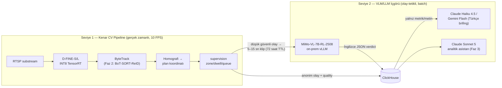

# 3. AI Model Katmanı

WherUGo'nun AI mimarisi tek bir sabit hükmün üzerine kuruludur: **VLM/LLM'ler asla gerçek zamanlı takip yapmaz.** 2 FPS örnekleme ile çalışan bir VLM'in 25 FPS'lik takip döngüsüne sokulması hem fiziksel hem ekonomik olarak imkânsızdır (kamera başına günde ~2M kare). Bu nedenle AI katmanı iki net seviyeye ayrılır:

Seviye 1 her kareyi işler ve *olay* üretir; Seviye 2 bu olayların yalnızca seçilmiş bir alt kümesini *yorumlar*. Ham video mağazayı asla terk etmez; ticari API'lere yalnız metin ve metrik gider.

## 3.1 Seviye 1 — Gerçek Zamanlı CV Pipeline

### Model seçimleri ve lisans hijyeni

Ticari kapalı-kaynak bir SaaS için lisans, doğruluk kadar belirleyicidir. Kesinleşen seçimler ve yasak listesi:

| Görev | Model | Lisans | Durum | Gerekçe |
|---|---|---|---|---|
| Kişi tespiti | **D-FINE-S/L** (INT8 TensorRT) | Apache-2.0 | **Gün 1** | L: 54.0 COCO AP, 31M param, T4'te 8.07 ms; ICLR 2025 Spotlight |
| Tespit (yedek) | RT-DETRv2-R18 / RF-DETR-M | Apache-2.0 | Yedek | D-FINE ile aynı lisans sınıfı, A/B için hazır |
| Takip (pilot) | **ByteTrack** (supervision impl.) | MIT | **Gün 1** | Kamera-içi metrikler için yeterli, tracker maliyeti ~ihmal edilebilir |
| Takip (Faz 2) | **BoT-SORT-ReID + OSNet-x0.25** | MIT (orijinal repolar) | Kapılı | MOT20 (kalabalık) lideri; yalnız cross-camera ihtiyacı kanıtlanırsa |
| Cross-camera ReID | SOLIDER / CLIP-ReID fine-tuned | Apache-2.0 / açık | Faz 2, DPIA şartlı | Market-1501 mAP %93.9 / %89.8; embedding yalnız RAM, ziyaret sonu crypto-shredding |
| Poz | **RTMPose-m** | Apache-2.0 | Faz 2 | 75.8 AP, Intel i7 CPU'da 90+ FPS — GPU bütçesi yemez |
| Davranış (iskelet) | ST-GCN/GRU (pickup/putback) | Apache-2.0 | Faz 2 | MERL Shopping + kendi verimizle; enum değerleri şemada gün 1'de rezerve |
| ❌ Ultralytics YOLOv8/11/26 | — | AGPL-3.0 | **Yasak** | SaaS'ta kaynak açma yükümlülüğü |
| ❌ YOLO-NAS ağırlıkları | — | Non-commercial | **Yasak** | Üretim kullanımı lisans ihlali |
| ❌ BoxMOT kütüphanesi | — | AGPL-3.0 | **Yasak** | MIT orijinal repolardan entegre edilir |

Zone/dwell/queue mantığı **supervision (MIT)** ile framework-bağımsız yazılır: ne DeepStream'e ne NVIDIA'ya kilitlenme vardır; Faz 3'te OpenVINO ikinci hedefi ve NVIDIA sahalarında DeepStream+MV3DT bu soyutlamanın üzerine opsiyonel hızlandırıcı olarak gelir.

### FPS / donanım bütçesi

| Kalem | Pilot (Orin Nano Super) | Faz 2 standardı (Orin NX 16GB) |
|---|---|---|
| Kamera kapasitesi | 8–12 kamera @ 10 FPS | 11–16 kamera @ 10–15 FPS (docs/06 §6.2) |
| Tespit bütçesi | D-FINE-S INT8, ~kare başına <10 ms | D-FINE-L INT8 |
| Motion gating (Frigate deseni) | Efektif kapasite 2–5× | Aynı |
| Takip maliyeti | ByteTrack ~0 (CPU) | BoT-SORT-ReID + OSNet-x0.25 (~0,2M param; tam boy x1.0 2,2M) |
| Poz | — (kapalı) | RTMPose-m, CPU'da; GPU'ya dokunmaz |
| Akış | go2rtc tek-çekiş: substream tespite, full-res yalnız doğrulama klibine | Aynı |

Her olaya gün 1'den `quality{conf, occlusion_ratio, coverage_ok}` alt-nesnesi eklenir — Seviye 2'nin hangi olayları hakemliğe alacağını bu alanlar belirler.

## 3.2 Seviye 2 — VLM/LLM İçgörü Katmanı

### MiMo-VL-7B: rolü ve dürüst değerlendirmesi

Kullanıcının örnek verdiği **Xiaomi MiMo-VL-7B-RL-2508 (MIT)**, on-prem vLLM üzerinde üç net rolde konumlanır:

1. **Olay-tetikli sahne hakemi:** CV pipeline'ın düşük güvenli olayları (şüpheli dwell, belirsiz pickup, kuyruk terki) → 5–15 sn klip → yapılandırılmış İngilizce JSON. Düşük gecikmeli sınıflandırmada `/no_think`, anomali açıklamasında thinking mode — tek modelle iki profil.
2. **Ground-truth ön-etiketleyici:** insan anotasyonunu 5–10× hızlandırır; kalibrasyon düzleminin maliyetini taşınabilir kılan kritik roldür.
3. **Anomali ön-açıklaması** (Faz 2).

| MiMo-VL-7B-RL-2508 | Değerlendirme |
|---|---|
| ✅ Lisans | MIT — ticari kullanım tartışmasız serbest |
| ✅ Benchmark | MMMU 70.6, VideoMME 70.8, iç Arena Elo 1131.2 (7B–72B açık modeller arasında 1.) |
| ✅ Kullanım deseni uyumu | 2 FPS örnekleme, klip başına maks 256 kare, 16K token — tam olarak "kısa klip sınıflandırma" tasarımı |
| ✅ Kanıtlanmış fine-tune şablonu | Xiaomi'nin **MiMo-VL-Miloco** çalışması (ev kamerası davranış tanıma, CoT-SFT + GRPO) bizim yapacağımız işin birebir reçetesi |
| ⚠️ Türkçe | Belgelenmemiş; eğitim verisi İngilizce/Çince ağırlıklı — **Türkçe çıktı MiMo'ya emanet edilmez** |
| ⚠️ Ekosistem olgunluğu | vLLM/SGLang desteği var ama quantization/araç ekosistemi Qwen kadar olgun değil |
| ⚠️ Yol haritası riski | Xiaomi'nin stratejik odağı "insan-araba-ev"; perakende birincil hedef değil — tek-tedarikçi riski soyutlamayla yönetilir |

**Korkuluklar:** VLM çıktısı `vlm_verdict` alanında *öneri* olarak durur; insan onayı olmadan asla ground-truth sayılmaz. Klipler 72 saat TTL'lidir ve hiçbir ticari API'ye gitmez.

### Model-agnostik soyutlama ve alternatifler

Tüm Seviye 2 trafiği self-hosted **LiteLLM** proxy'sinden geçer: MiMo vLLM endpoint'i ve bulut API'leri tek OpenAI-uyumlu çatı altındadır. Provider değişimi konfigürasyon değişikliğidir, kod değişikliği değil. Tek istisna: derin tool-use gerektiren analitik asistan, sağlayıcının native SDK'sını (prompt caching, server-side tools) ince bir kendi arayüzümüz arkasında kullanır.

| Model | Lisans / Fiyat ($/1M in-out) | WherUGo'daki yeri |
|---|---|---|
| **MiMo-VL-7B-RL-2508** | MIT, self-host | Birincil klip hakemi + ön-etiketleyici |
| **Qwen3-VL-8B** | Apache-2.0, self-host | **Kalıcı A/B adayı** — daha uzun bağlam, daha geniş dil desteği |
| InternVL3 (küçük varyant) | Karma lisans | İzleme listesi; doküman/grafik analizi güçlü, lisans varyant-bazlı doğrulanmalı |
| Claude Haiku 4.5 | 1.00 / 5.00 | Günlük **Türkçe brifing** (batch %50 indirim + prompt caching) |
| Gemini 2.5 Flash-Lite | batch 0.05 / 0.20 | Brifing için en ucuz alternatif (~$0.15–0.60/gün/mağaza) |
| Claude Sonnet 5 | 3.00 / 15.00 | Faz 3 analitik asistan (tool-use) |
| GPT-5.x ailesi | 1.00–5.00 / 6.00–30.00 | LiteLLM üzerinden yedek sağlayıcı |
| Gemini 3 Flash | 0.50 / 3.00 | Native video girişli yedek |

Model kademelendirme ekonomik olarak zorunludur: klip-düzeyi analiz on-prem açık modelle, metin-düzeyi içgörü ucuz ticari API ile yapılır — bu ayrım 100+ mağazada yıllık ~$1M fark eder.

## 3.3 Hangi İş Yükü Hangi Seviyeye Ait

| İş yükü | Seviye | Model | Neden |
|---|---|---|---|
| Kişi tespit/takip, sayım, dwell, kuyruk | 1 | D-FINE + ByteTrack + supervision | 10 FPS süreklilik; VLM fiziksel olarak yetişemez |
| Cross-camera eşleştirme | 1 (Faz 2) | OSNet/SOLIDER embedding | Milisaniye bütçesi, anonim vektör işi |
| Pickup/putback sınıflandırma | 1 (Faz 2) | RTMPose + ST-GCN | İskelet dizisi ucuz ve KVKK-dostu |
| Belirsiz olay hakemliği (klip) | 2 | MiMo-VL `/no_think` | Açık-uçlu görsel muhakeme gerekir |
| Anotasyon ön-etiketleme | 2 | MiMo-VL | İnsan hızını 5–10× katlar |
| Günlük Türkçe yönetici brifingi | 2 | Claude Haiku 4.5 / Gemini Flash | Görüntü gerektirmez; Türkçe kalitesi kritik |
| Analitik asistan (SQL + tool-use) | 2 (Faz 3) | Claude Sonnet 5 | Çok adımlı muhakeme + function calling |
| Yüksek hacimli klip ön-filtresi | 2 (Faz 3) | X-CLIP → VideoMAE cascade | Klip hacmi MiMo maliyetini aşınca devreye girer |

## 3.4 Doğal Dil Analitik Asistanı

"Bu hafta hangi bölge neden zayıftı?" sorusunun cevabı bir LLM halüsinasyonu değil, tool-use zinciridir: Sonnet 5, `zone_hourly`/`queue_hourly` MV'lerine ve `coverage_gaps` tablosuna SQL araçlarıyla erişir; gateway `tenant_id` filtresini ve k<10 bastırmayı asistan sorgularına da enjekte eder — asistan tekil müşteri verisi *göremez*. **Her sayısal iddiaya kaynak metrik ID'si iliştirilir**: "Kozmetik bölgesi footfall'u %18 düştü [zone_hourly:2026-W27:Z14]; aynı hafta 2 saatlik kapsam boşluğu düzeltmesi uygulandı [coverage_gaps:...]". Pilotta bu rolün öncülü günlük Türkçe brifingdir (Ay 4–6, Haiku/Flash batch); tam konuşan-dashboard Faz 3 kapısındadır.

## 3.5 Model Değerlendirme / Benchmark Planı

| Aşama | Test | Eşik / Karar |
|---|---|---|
| Pilot devreye alma | 2–4 saatlik "sayım günü" ground-truth | Giriş sayımı ≥%90, dwell MAPE ≤%15; tutmazsa top-down dome fallback |
| Ay 4–6 | MiMo klip hakemliği: 200 klip, insan etiketiyle A/B | VLM açılış kararı bu sonuçla verilir |
| Sürekli | **MiMo vs Qwen3-VL-8B A/B:** 1.000 klip, insan çift-anotasyon | **Cohen's kappa > 0.75**; altında kalırsa VLM yalnız ön-filtre olur, insan anotasyon maliyeti fiyatlamaya girer |
| Provider değişimi öncesi | Sabit eval seti: klip sınıflandırma doğruluğu + Türkçe brifing kalitesi (rubrik) | Eval seti olmadan "değiştirilebilirlik" kağıt üzerinde kalır — LiteLLM'e model eklemenin ön şartı |
| Faz 2 | Cross-camera eşleştirme kesinliği | ≥%80; altındaysa kamera-yerel modda kalınır |

## 3.6 Fine-Tuning İhtiyacı Değerlendirmesi

| Model | İhtiyaç | Zamanlama | Gerekçe |
|---|---|---|---|
| D-FINE | Düşük→orta | Faz 2 | COCO "person" güçlü taban; tepe-açı/raf oklüzyonu verisiyle hafif fine-tune yeterli |
| ReID (SOLIDER/CLIP-ReID) | **Zorunlu** | Faz 2, cross-camera öncesi | SOTA modellerde başörtüsü/tesettür giyimde mAP %38–51 düşüyor — Türkiye kıyafet dağılımıyla fine-tune şart |
| ST-GCN davranış | Zorunlu | Faz 2 | Perakende davranışları için kamuya açık veri yok; MERL + kendi etiketli kliplerimiz |
| VideoMAE | Orta | Faz 3 | Üretimde biriken etiketli kliplerle; cascade'in kapalı-taksonomi katmanı |
| MiMo-VL | Opsiyonel | Faz 3 kapısı | Miloco reçetesi (difficulty-aware filtering + GRPO) mağaza senaryosuna uyarlanır; ancak yalnız zero-shot kappa yetersiz kalır *ve* klip hacmi ekonomiyi haklı çıkarırsa |
| Türkçe LLM | **Yok** | — | Brifing ticari API'de kalır; 7B modele Türkçe fine-tune yatırımı yapılmaz |

## 3.7 Model Drift İzleme

Fazlı yaklaşım: şema alanları gün 1'de, otomasyon kanıt kapısından sonra.

- **Gün 1 (hafif):** günlük **sahne sağlık kontrolü** — referans kareyle blur/açı/aydınlatma karşılaştırması, homografi drift bayrağı; `quality.conf` dağılımının ve `coverage_gaps`'in günlük özeti; `device_health` tablosunda det_fps/decode_fps takibi.
- **Faz 2 (tam):** tespit güven skoru ve olay-oranı dağılımlarında **PSI/KS testleri**, kamera başına otomatik yeniden kalibrasyon tetikleyicisi; VLM tarafında aylık 100-klip örneklemiyle kappa yeniden ölçümü (VLM drift'i — model güncellemeleri sessizce davranış değiştirebilir); haftalık ~30 dk insan anotasyonu drift'in ground-truth çapasıdır.
- **Faz 2+ dağıtım güvenliği:** her model/prompt sürümü imzalı OTA ile %5 canary'ye çıkar; kalite rozeti kırmızıya dönen kamera oranı canary geri-alma kriteridir.

Bu katmanın mimari borcu bilinçlidir: pahalı-değiştirilenler (lisans-temiz model seçimi, LiteLLM soyutlaması, `vlm_verdict`/`quality` şema alanları, eval seti disiplini) gün 1'de kurulur; pahalı-işletilenler (cascade, fine-tune hatları, tam drift otomasyonu) kanıt kapılarının arkasında bekler.
