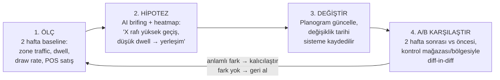

# Analitik ve Metrikler

Bu bölüm, WherUGo'nun ürettiği tüm metriklerin kesin tanımlarını, hesaplama yöntemlerini ve hangi persona için hangi öncelikle sunulacağını tanımlar. Tüm metrikler K2 olay sözleşmesindeki `zone_events`, `track_positions`, `coverage_gaps` ve `pos_daily` tablolarından, saatlik/günlük materialized view'lar (`zone_hourly`, `queue_hourly`) üzerinden türetilir. Tüm hesaplamalar K2 şemasında tanımlı olay tipleriyle sınırlıdır; ürün etkileşimi (`product_interaction` — pickup/putback enum'ları Faz 2'de dolar) ve çalışan-müşteri yakınsaması (`staff_interaction`) şemada **birbirinden ayrı iki olay tipidir**, aynı ad altında karıştırılmaz. **k<10 hücre bastırma gateway'de zorunludur** — hiçbir görünümde tekil müşteri izlenemez; çalışan metrikleri yalnız vardiya/mağaza agregatı düzeyinde raporlanır (KVKK ilkesi: "kasada ortalama karşılama süresi 45 sn", asla "Ayşe bugün 3 kez geç kaldı").

## 1. Metrik Kataloğu

Öncelikler: **P0** = pilot MVP (Faz 0–1), **P1** = farklılaşma (Faz 2), **P2** = premium (Faz 2–3). Personalar: **MM** = mağaza müdürü, **BM** = bölge müdürü, **ME** = merchandising ekibi.

| Metrik | Tanım | Hesaplama Yöntemi | Persona | Öncelik |
|---|---|---|---|---|
| **Footfall** (staff-excluded) | Birim zamanda mağazaya giren müşteri sayısı | Girişteki top-down dome'un kapsadığı `entrance` tipi zone'da `zone_enter` olayları (ByteTrack track'lerinin sanal giriş zone'una girişi); track_id'si `track_update` akışında `is_staff=1` işaretli track'ler (BLE beacon/üniforma) eşleştirmeyle hariç tutulur; `coverage_gaps` ile boşluk düzeltmesi | MM, BM | **P0** |
| **Occupancy** | Anlık mağaza doluluğu | `entrance` zone'unda kümülatif `zone_enter` − `zone_exit`; günlük gece sıfırlama + drift kontrolü | MM | **P0** |
| **Unique visitors** | Tekil ziyaret sayısı | Pilotta giriş sayımı ≈ ziyaret (kamera-yerel takip); Faz 2'de cross-camera ReID (≥%80 eşleştirme kesinliği şartıyla) ile mağaza-içi tekilleştirme. Günler-arası re-ID **yapılmaz** (EDPB 01/2025, crypto-shredding) — "tekrar ziyaret" metriği bilinçli olarak kapsam dışı | MM, BM | **P1** |
| **Dwell time (bölge)** | Müşterinin bir zone'da geçirdiği süre | `zone_events` enter→exit eşleşmesi, `dwell_sec`; `zone_hourly`'de p50/p95 olarak; asla tek ortalama değil | MM, ME | **P0** |
| **Dwell time (toplam ziyaret)** | Giriş–çıkış arası toplam mağaza süresi | Pilotta giriş zone'u `zone_enter`/`zone_exit` zaman damgalarının dağılım eşleştirmesi (istatistiksel); Faz 2'de cross-camera track birleştirmeyle kesinleşir | MM, BM | **P1** |
| **First destination** | Girişten sonra ilk uğranan bölge | Giriş zone'u `zone_enter` sonrası aynı track'in ilk farklı `zone_enter` olayı. **Pilotta kamera-yerel takip nedeniyle yalnız giriş dome'unun görüş alanındaki giriş-bitişik zone'lar için hesaplanır** — decompression zone (kapı sonrası 3–5 m) yığılma analizi bu kapsam içindedir; tam mağaza first destination Faz 2 cross-camera ReID kapısına (≥%80 kesinlik + DPIA) bağlıdır, kapı açılmazsa metrik giriş-bitişik kapsamla sınırlı kalır | ME | **P1** |
| **Path analysis** | Bölgeler arası güzergâh ve geçiş matrisi | Zone-ziyaret dizileri üzerinden Markov geçiş matrisi + en sık k-yol; atlanan bölüm tespiti. Pilotta kamera-yerel segmentler, Faz 2'de tam mağaza yolu | ME, BM | **P1** |
| **Heatmap — yoğunluk** | Nereden kaç kişi geçti | `track_positions` (1 Hz) homografiyle zemin düzlemine projeksiyon, hücre bazlı sayım; `plan_svg` üzerine overlay | MM, ME | **P0** |
| **Heatmap — dwell** | Nerede ne kadar duruldu | Aynı grid'de hız < eşik konum örneklerinin süre ağırlıklı toplamı | ME | **P0** |
| **Heatmap — akış (directional)** | Hangi yöne, hangi sırayla | Ardışık konum vektörlerinden hücre başı baskın yön; deck.gl akış görselleştirmesi Faz 2 | ME | **P1** |
| **Zone engagement / draw rate** | Bölge önünden geçenlerin durma/etkileşim oranı | `pass_by` vs `enter` + `dwell_sec > eşik` oranı; raf çekim gücü sıralaması | ME | **P0** |
| **Conversion funnel** | Geçen → giren → zone ziyareti → engagement → pickup → satış | Kademe başına oran; `pass_by` / giriş `zone_enter` (footfall) / bölge `zone_enter` / `dwell_sec` / `product_interaction=pickup` (Faz 2) olayları + `pos_daily`; sızıntı kademesi vurgulanır | MM, BM, ME | P0 (POS conversion) / **P1** (tam funnel) |
| **Kuyruk uzunluğu + bekleme süresi** | Kasa kuyruğu anlık durum ve p95 bekleme | Anlık uzunluk: `queue` tipi zone'da eşzamanlı track sayısı (`queue_measurement`, 30 sn); bekleme: kuyruk zone'unun kişi-başı `zone_enter`→`zone_exit` dwell'i, p95 olarak; eşik aşımında **"kasa aç" gerçek zamanlı alarmı** (edge'de, buluta gitmeden) | MM | **P0** |
| **Kuyruk terki + kaybedilen ciro** | Kuyruğa girip satın almadan ayrılan müşteri | Kuyruk zone'undan `zone_exit` sonrası eşik süre içinde checkout zone'una `zone_enter` gelmemesi → terk olarak sınıflandırılır; `queue_measurement.abandons_since_last` sayacıyla çapraz doğrulama; terk sayısı × ATV = ₺ kayıp tahmini; belirsiz vakalar MiMo-VL klip hakemliğine düşer (`vlm_verdict`) | MM, BM | **P1** |
| **Çalışan-müşteri etkileşimi** | Yardım oranı, time-to-greet, servis kör noktası | `is_staff=1` ve müşteri track'lerinin aynı zone'da < 1,5 m yakınsaması ≥ 10 sn → `staff_interaction` olayı (K2 şemasında ürün etkileşimini taşıyan `product_interaction`'dan ayrı olay tipi); **yalnız vardiya/mağaza agregatı**; servis kör noktası = yüksek-dwell ∩ sıfır-etkileşim zone'ları. INFORMS referansı: yardım oranı %50→%60 = dönüşüm +5 puan | MM, BM | **P1** |
| **Vitrin dönüşümü (capture rate)** | Önünden geçenlerin içeri girme oranı | Vitrine bakan kameradan `pass_by` sayımı ÷ footfall; vitrin değişikliği öncesi/sonrası karşılaştırma | ME, BM | **P1** |
| **Pickup / putback** | Ürünü eline alma / geri koyma | RTMPose iskelet + sınıflandırma (Faz 2; `product_interaction` olayının pickup/putback enum değerleri şemada gün 1'de rezerve); raf bandı (göz hizası 91–152 cm) etkinlik analizi | ME | **P2** |
| **Bounce rate (mağaza içi)** | <1 dk'da hiçbir bölgeye uğramadan çıkanlar | Giriş–çıkış süresi + zone ziyaret sayısı = 0 filtresi | MM | **P2** |
| **Trafik tahmini + vardiya önerisi** | Saatlik trafik forecast'ı ve staffing planı | `zone_hourly` zaman serisi + mevsimsellik; dönüşüm +%4,5 kanıtlı değer | MM, BM | **P2** |

## 2. POS Entegrasyonuyla Zenginleştirme

Pilotta `pos_daily` (günlük işlem sayısı + ciro, CSV/API import) yeterlidir; Faz 2'de saatlik POS beslemesi açılır. POS füzyonu üç metrik türetir: **gerçek conversion rate** (işlem ÷ staff-excluded footfall), **ATV** (ciro ÷ işlem) ve **ziyaretçi başına satış**. Asıl değer teşhis ayrımındadır: bir kategoride **"trafik + dwell var ama satış yok"** → yerleşim/fiyat sorunu; **"trafik yok"** → konum/navigasyon sorunu. Kuyruk terki × ATV çarpımı, "sabırsızlığa kaybedilen ciro"yu ₺ cinsinden raporlar — POS'un tek başına asla göremediği olay budur ve satış anlatısının çekirdeğidir.

## 3. Ürün Yerleşimi Optimizasyon Döngüsü

Kurallar: (1) karşılaştırma dönemleri eşit uzunlukta ve aynı haftanın günlerini kapsar; (2) kontrol birimi (aynı mağazada eş profilli bölge veya zincirde eş mağaza) zorunludur — mevsimsellik ve kampanya etkisi diff-in-diff ile ayrıştırılır; (3) her iki dönemde **veri kalite rozeti yeşil olmayan günler karşılaştırmadan düşülür** (`coverage_gaps` kontrolü); (4) sonuç, Faz 2'den itibaren güven aralığıyla raporlanır — "dwell %12 ± 4 arttı" formatı GA hesabı gerçekten yapılınca açılır, öncesinde yalnız p50/p95 + rozet gösterilir (sahte hassasiyet satılmaz). Pilot kapı kriterlerinden biri tam olarak bu döngünün bir kez pozitif sonuçla kapanmasıdır.

## 4. Dashboard Tasarımı (Persona Bazlı)

Custom React + ECharts; ısı haritaları `store.plan_svg` üzerine overlay. Metrik hiyerarşisi **outcome → driver → diagnostic** düzeninde: önce sonuç (dönüşüm, ciro/ziyaretçi), altında sürücüler (trafik, dwell, kuyruk), en altta teşhis (heatmap, path, coverage).

| Görünüm | Faz | İçerik |
|---|---|---|
| **Mağaza müdürü** (pilot personası) | Faz 0–1 | Bugünkü trafik vs geçen hafta, anlık occupancy, **gerçek zamanlı kuyruk alarmı**, saatlik dönüşüm, günün 3 aksiyonu ("şimdi ne yap"), veri kalite rozeti |
| **Bölge müdürü** | Faz 2 | Mağazalar arası benchmark, lig tablosu, outlier tespiti, controllable execution (dönüşüm/servis/labor) karşılaştırması, haftalık trend |
| **Merchandising** | Faz 2 | Zone/kategori funnel'ı, üç heatmap, draw rate sıralaması, planogram A/B sonuç kartları, first destination + atlanan bölge analizi |

Her metrik kartında **veri kalite rozeti** gün 1'den itibaren bulunur (bkz. §6) ve her KPI'ın dokümante tanımı + formülü dashboard'dan tek tıkla erişilebilir — governance güven demektir. REST API/webhook Faz 2'de; Faz 3'te Claude Sonnet 5 "konuşan dashboard" (tool-use ile metrik sorgulama) eklenir.

## 5. Raporlama — Haftalık Otomatik AI İçgörü Raporu

Üretim hattı: `zone_hourly`/`queue_hourly` agregatları + MiMo-VL'nin olay bazlı İngilizce JSON çıktıları (`vlm_insights`) → **Claude Haiku 4.5 / Gemini Flash** batch (LiteLLM üzerinden) → Türkçe brifing. Buluta asla görüntü gitmez, yalnız metrik ve metin. Maliyet ~$0,15–0,60/gün/mağaza. **Her sayısal iddiaya kaynak metrik ID'si iliştirilir** — halüsinasyon önlemenin denetlenebilir yolu. Örnek rapor parçası:

> **WherUGo Haftalık Brifing — Mağaza #12, 29 Haz–5 Tem**
>
> **Öne çıkan:** Dönüşüm oranı %21,4 (geçen hafta %19,8) `[M-CONV-D12-W27]`. Trafik %3 düştü ama kuyruk p95 bekleme 6,2 dk'dan 3,9 dk'ya indi `[M-QW-P95-W27]` — Salı günü devreye alınan "ikinci kasa" alarmı 11 kez tetiklendi, 9'unda 4 dk içinde kasa açıldı.
>
> **Sızıntı:** Kişisel bakım koridoru haftanın en yüksek geçiş trafiğini aldı (4.310 geçiş `[M-ZT-Z07-W27]`) ancak draw rate %8'de kaldı (mağaza medyanı %19). VLM klip incelemesi (14 olay, ort. güven 0,81) müşterilerin üst rafa uzanıp vazgeçtiğini işaretledi `[VLM-2107..2120, insan onayı bekliyor]`. **Öneri:** Kampanyalı SKU'ları 91–152 cm bandına indirin; değişikliği panelden kaydedin, sistem 2 haftalık diff-in-diff karşılaştırmasını otomatik başlatır.
>
> **Veri notu:** Çarşamba 14:05–15:20 Kamera-3 kapsam boşluğu `[GAP-C3-0702]`; o dilimin zone metrikleri düzeltme katsayısıyla tahmin edildi, rozet sarı.

## 6. Doğruluk ve Güven: Hata Payı Raporlama Modeli

WherUGo'nun satış farklılaştırıcısı doğruluğun kendisi değil, **doğruluğun denetlenebilirliğidir**. Üç mekanizma:

1. **Veri kalite rozeti (gün 1):** Yeşil = kalibre + tam kapsam; Sarı = `coverage_gaps` boşluğu düzeltme katsayısıyla kapatıldı; Kırmızı = kamera kalibrasyonu süresi dolmuş (`calib_expires_at`) veya sahne sağlık kontrolü (blur/açı/homografi drift) başarısız. Rozet her metrik kartında ve her raporda görünür.
2. **Metrik başına hata kaynağı ve raporlama biçimi:** Sayım metriklerinde hata kaynağı kapsam boşlukları ve tespit kaçırmalarıdır → devreye alma "sayım günü" ground-truth'una göre sapma yüzdesi metrik tanımında yayınlanır (pilot kapı kriteri: giriş sayımı ≥%90). Dwell'de hata kaynağı track kopmalarıdır (`quality.id_switch_risk`) → p50/p95 dağılım olarak raporlanır, tek ortalama verilmez (kapı kriteri: MAPE ≤%15). Konum metriklerinde taban, kurulumda kaydedilen `reproj_error_cm`'dir → heatmap hücre boyutu bu hatanın altına inemez.
3. **Kalibrasyon düzlemi (Faz 2):** `calibration_run` tablosu (şemada gün 1'den var, boş durur) kamera başı düzeltme katsayısı + %95 GA üretir; haftalık ~30 dk örnekleme anotasyonu (MiMo ön-etiketli, insan onaylı — VLM çıktısı onaysız asla ground-truth sayılmaz) katsayıları tazeler. Bu noktadan itibaren dashboard dili "%12 ± 4" formatına geçer ve sözleşmelere ölçülebilir doğruluk taahhüdü yazılabilir.

Temel ilke her fazda geçerlidir: **"veri yok" asla "müşteri yok" olarak raporlanmaz** — `coverage_gaps` tablosu ve `seq_no` boşluk tespiti bu ayrımı şema düzeyinde garanti eder.
