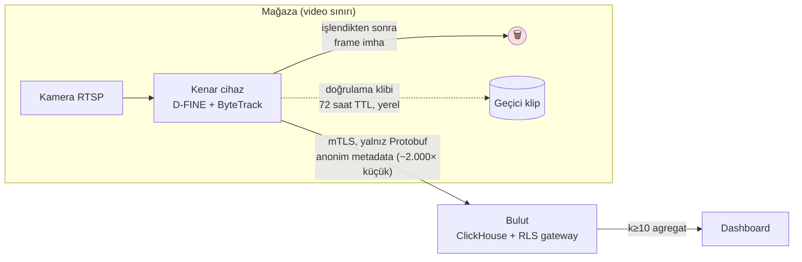

# 05 — Gizlilik ve Hukuki Uyum (KVKK / GDPR)

> **⚠️ UYARI — Bu bölüm hukuki tavsiye değildir.** Aşağıdaki analiz mühendislik ve ürün planlamasına girdi olarak hazırlanmıştır. Aydınlatma metinleri, veri işleme sözleşmeleri (DPA), meşru menfaat analizleri ve DPIA şablonları dahil tüm hukuki dokümanlar, üretime alınmadan önce **KVKK alanında uzman bir avukat tarafından incelenip onaylanmalıdır.** Faz 2'de cross-camera ReID'in açılması, ayrıca yazılı KVKK uzman görüşü + DPIA'ya bağlı bir kapı koşuludur.

## 5.1 Temel İlke: Privacy by Design — Politika Değil, Mimari

WherUGo'da gizlilik bir "uyum katmanı" değil, mimarinin kendisidir. Prensip şudur: **ihlal, şema düzeyinde imkânsız kılınır.** Protobuf olay sözleşmesinde piksel taşıyan alan yoktur; ClickHouse/PostgreSQL şemasında bireysel çalışan tablosu yoktur; dashboard gateway'i k<10 hücreleri fiziksel olarak bastırır. Yanlış yapılandırılmış bir cihaz bile buluta görüntü gönderemez, çünkü sözleşmede o alan tanımlı değildir.

Bu radikal bir tercih değil, sektör ve regülasyon gerçeğidir: KVKK Kurulu'nun **2022/797 sayılı kararı** (işyerinde yüz tanıma → 500.000 TL ceza), **2026/921 sayılı ilke kararı** (mesai takibinde biyometri: açık rıza olsa bile ölçüsüz) ve **Haziran 2026 güvenlik kamerası duyurusu** tutarlı bir çizgi kuruyor. AB tarafında Mercadona'ya 48 mağazada yüz tanıma için **€2,52M ceza** kesildi; EU AI Act Art. 5 işyerinde emotion recognition'ı yasaklıyor (**€35M veya global cironun %7'sine kadar**). 2026 itibarıyla KVKK idari para cezaları **85.437 TL – 17.092.242 TL** aralığında.

## 5.2 Teknik Önlemler (Mimariye Gömülü)

1. **Video mağazayı asla terk etmez.** Tüm CV işleme kenar cihazda; buluta yalnız anonim metadata (koordinat, zone geçişi, kuyruk uzunluğu) gider. Ham frame'ler inference sonrası bellekte imha edilir.
2. **Yüz tanıma yok; yüz tespiti yalnız bulanıklaştırma için.** Debug/kalibrasyon karelerinde ve VLM doğrulama kliplerinde **otomatik face-blur opsiyonu** kenarda, saklamadan önce uygulanır. Yüz template'i hiçbir bileşende üretilmez.
3. **Anonim geçici track ID.** Ziyaretçiler rastgele `track_id` (UInt64) ile izlenir; kimlikle eşleştirilebilecek hiçbir alan yoktur. ReID embedding'leri (Faz 2, DPIA onayıyla) yalnız RAM/şifreli geçici depoda yaşar.
4. **Ziyaret sonu embedding silme.** Çıkış tespiti veya hareketsizlik zaman aşımında embedding **crypto-shredding** (anahtar imhası) ile geri döndürülemez silinir ve silme loglanır. Günler-arası, mağazalar-arası re-identification **yapılmaz**. Not: EDPB 01/2025 gereği embedding yaşadığı sürece pseudonim kişisel veridir — bu pencerede tüm yükümlülükler geçerli kabul edilir.
5. **Mikrofon yok** (donanım şartnamesi — Yargıtay ses kaydı içtihadı) ve kurulum sihirbazında **mahrem alan maskesi zorunlu adım** (deneme kabini, kasa PIN alanı, vitrin dışı sokak).
6. **k<10 hücre bastırma** sorgu gateway'inde zorunlu — dashboard'a tekil müşteri izi sızamaz.
7. **VLM/LLM sınırı:** Ham klip yalnız on-prem MiMo-VL'e gider; ticari API'lere (Claude Haiku 4.5 / Gemini Flash brifingi) **yalnız metin ve metrik** çıkar, asla görüntü.
8. **Güvenlik:** edge→cloud mTLS, disk şifreleme, imzalı OTA (Faz 2), RBAC + `audit_log`, PostgreSQL RLS + gateway'de `tenant_id` enjeksiyonu.

**Veri saklama süreleri:**

| Veri | Konum | Saklama | İmha |
|---|---|---|---|
| Ham video frame | Kenar cihaz RAM | İşleme anı (<1 sn) | Otomatik, anlık |
| Doğrulama/VLM klibi (5–15 sn) | Kenar, şifreli | **72 saat TTL** | Otomatik + log |
| ReID embedding (Faz 2) | Kenar RAM/şifreli | Ziyaret süresi | Crypto-shredding + silme logu |
| `track_positions` (1 Hz anonim koordinat) | ClickHouse | **90 gün TTL** | ClickHouse TTL |
| `zone_events`, saatlik rollup'lar | ClickHouse | Süresiz (anonim/agregat) | — |
| `audit_log`, `coverage_gaps` | PG/CH | Sözleşme süresi | Tenant-wipe |
| Tenant verisi (fesihte) | Tümü | — | Otomatik tenant-wipe + **imha sertifikası** |

Periyodik imha döngüsü Yönetmelik gereği en geç 6 aylık periyotlarla işletilir ve loglanır.

## 5.3 KVKK Uyum Kontrol Listesi

- ☐ **Hukuki dayanak:** m.5/2-f **meşru menfaat** — mağaza başına LIA (denge testi) şablonu doldurulur: menfaatin somutluğu, daha az müdahaleci alternatif yokluğu, ilgili kişi haklarının ağır basmaması. "Her ihtimale karşı açık rıza" toplanmaz (Kurul pratiğinde dürüstlük kuralına aykırı sayılabiliyor).
- ☐ **Katmanlı aydınlatma:** girişte, izleme alanına girmeden görülebilen tabela (kamera ikonu + veri sorumlusu unvanı + amaç + QR) → QR ile tam aydınlatma metni + public şeffaflık sayfası. Aydınlatma, işleme **başlamadan önce**.
- ☐ **VERBİS:** kayıt yükümlülüğü perakendecinindir (eşik: >50 çalışan veya >100M TL bilanço); WherUGo, kamera analitiği amacının sicile eklenmesi için kılavuz sağlar. WherUGo kendi verileri için eşiği aşarsa kendisi de kaydolur.
- ☐ **Veri işleyen sözleşmesi (DPA):** roller net — **perakendeci = veri sorumlusu, WherUGo = veri işleyen.** Sözleşme içeriği: işleme talimatları, alt işleyen onayı, erişim logları, şifreleme, **72 saat ihlal bildirimi**, denetim hakkı, fesihte silme/iade. m.12 güvenlik yükümlülüğü müteselsilen bizi de bağlar. Model eğitimi müşteri görüntüsüyle yapılmaz (yapılsaydı o faaliyet için veri sorumlusu olurduk) — yalnız sentetik/lisanslı veri + anonim confidence dağılımları.
- ☐ **İlgili kişi başvuruları:** 30 gün yanıt prosedürü; görüntü talebi gelirse üçüncü kişileri bulanıklaştırma akışı (pratikte video zaten imha edildiğinden kapsam dar).

## 5.4 Çalışan İzleme: Hassasiyet ve Sınırlar

Türk iş hukukunda (TBK m.419, Yargıtay içtihadı) gizli izleme hukuka aykırı delil ve haklı fesih sebebidir; **sürekli bireysel performans gözetimi meşru amaç değildir** ve kıdem tazminatlı fesih riski doğurur. Bu yüzden:

- Çalışan metrikleri **yalnız vardiya/mağaza agregatı** ("karşılanan müşteri oranı %62") — bireysel çalışan skoru üretilmez ve **DB şemasında bireysel çalışan tablosu yoktur** (teknik imkânsızlık).
- Staff exclusion **BLE beacon/üniforma sınıflandırması** ile — biyometrik sinyal kullanılmaz (2026/921 ilke kararının ruhu).
- Çalışanlara **ayrı yazılı aydınlatma + tebliğ tutanağı**; varsa çalışan temsilcisi/sendika bilgilendirmesi; "bireysel skor üretilmez" yazılı taahhüdü DPA ekidir.

## 5.5 GDPR Farkları (AB Pazarı)

| Konu | KVKK (TR) | GDPR (AB) |
|---|---|---|
| Dayanak | m.5/2-f meşru menfaat + LIA | Art. 6(1)(f) legitimate interest + LIA (EDPB 3/2019) |
| Etki değerlendirmesi | İyi uygulama | **DPIA zorunlu** (Art. 35 — sistematik izleme) |
| Biyometri eşiği | m.6 özel nitelikli veri | Art. 9 — "uniquely identify" amaçlı template; salt sayım/tespit girmez |
| Ek yasak | — | **AI Act Art. 5:** işyerinde emotion recognition yasak; demografi çıkarımı high-risk |
| Saklama normu | 15–30 gün güvenlik kaydı pratiği | Çoğu üye devlette ~72 saat normu |
| Sicil | VERBİS | Records of processing (Art. 30) |

AB yol haritası kararı: **duygu analizi ve yaş/cinsiyet tahmini ürün kapsamına hiçbir pazarda alınmaz** — böylece TR/AB arasında özellik çatalı oluşmaz.

## 5.6 Müşteriye Sağlanan Uyum Paketi

Her kurulumla birlikte teslim edilir (satış sürtünmesini düşüren ürün bileşeni): giriş tabelası + katmanlı aydınlatma metni şablonları, LIA/DPIA şablonu (mağaza planına göre doldurulmuş), standart DPA, VERBİS güncelleme kılavuzu, çalışan aydınlatma + tebliğ tutanağı seti, saklama-imha politikası şablonu, QR'lı public şeffaflık sayfası ve fesihte **imha sertifikası**.

## 5.7 "Yapmayacaklarımız" — Yazılı Ürün Politikası

1. Yüz tanıma / kimlik tespiti — **asla.**
2. Duygu analizi, demografi (yaş/cinsiyet) tahmini — **asla.**
3. Günler/mağazalar arası kişi eşleştirme — **asla.**
4. Bireysel çalışan performans skoru — **asla.**
5. Ses kaydı — donanımda mikrofon dahi yok.
6. Görüntünün buluta/ticari API'lere aktarımı — sözleşme düzeyinde imkânsız.
7. Müşteri sahasından model eğitimi için ham görüntü toplama — **asla.**
8. Çocuk segmenti analitiği — çocuk tespiti yalnız sayım bütünlüğü için.

## 5.8 Uyum = Pazarlama Avantajı ("Privacy Moat")

V-Count, Terabee, FootfallCam gibi rakipler "GDPR-compliant by design"ı ana satış argümanı yapıyor; kategoride bu artık hijyen faktörü. WherUGo basit sayaçlardan daha zengin journey analitiği yaptığı için **daha güçlü ve denetlenebilir** bir hikâyeye ihtiyaç duyar — ve mimari bunu veriyor: "Videonuz mağazanızdan çıkmaz, buluta giden veride piksel alanı *şema gereği* yoktur; silmeleri loglarız, fesihte imha sertifikası veririz." Bu dil, zincir müşterilerinin hukuk departmanlarını satış engelinden referansa çevirir; kalite rozeti + coverage_gaps şeffaflığıyla birleşince "denetlenebilir doğruluk + denetlenebilir gizlilik" ikilisi sözleşmeye yazılabilir bir farklılaştırıcıdır.
