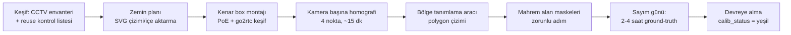

# 06 — Donanım ve Altyapı

## 6.1 Kamera Gereksinimleri ve Yerleşim İlkeleri

WherUGo'nun temel donanım felsefesi: **mevcut ONVIF/RTSP CCTV yeniden kullanımı birincil yoldur**; yalnızca sayım doğruluğunun sözleşme konusu olduğu noktalarda özel kamera zorunludur.

| Bölge | Kamera tipi | Montaj | Gerekçe |
|---|---|---|---|
| **Giriş/çıkış** | Top-down dome (2–4MP, ~$130/adet) | Kapı üstü, tam dikey | **Pilotta zorunlu.** Giriş sayımı POS-dönüşüm oranının paydasıdır; açılı kameraya emanet edilmez. Hedef: sayım doğruluğu ≥%90 |
| **Ana koridorlar** | Mevcut açılı CCTV veya tavan mini-dome | 2.7–3.5 m yükseklik | Akış yönü, pass-by, ısı haritası. Perspektif kaynaklı ID kaymaları kamera-içi metriklerde tolere edilir |
| **Bölgeler (raf/reyon)** | Mevcut açılı CCTV; kritik reyonlarda fisheye (6–12MP) | Tavan merkezi | Dwell/interaction. Fisheye "seçici kamera paketi" olarak fiyat listesinde — zorunlu değil, upsell |
| **Kasa/kuyruk** | Açılı kamera, kuyruk hattını boydan gören | Kasa arkası üst köşe | queue_join/abandon/wait tespiti; tek kamerayla tüm kuyruk poligonu görülmeli |

**Kapsama kuralları (kurulum sihirbazına gömülü):**
- Analitik kapsama hedefi: **~80–120 m² başına 1 kamera** (açılı, 2.8mm lens, 3 m yükseklik); fisheye ile ~150–200 m²/kamera. %100 kapsama hedeflenmez — kapsanmayan alanlar `coverage_gaps` mantığıyla dürüstçe raporlanır ("veri yok ≠ müşteri yok").
- Çözünürlük/FPS: model girişi 640×640'a küçültüldüğünden **1080p @ 10 FPS** analitik için yeterlidir; sayım-ağırlıklı bölgelerde 5 FPS'e düşürmek kenar kapasitesini 2–3× artırır.
- **Mikrofonsuz şartname** ve mahrem alan (deneme kabini, WC, personel odası) maskeleri kurulum sihirbazında zorunlu adımdır.

### Mevcut CCTV Yeniden Kullanım Kriterleri (keşif kontrol listesi)

Keşif ziyaretinde her kamera şu kriterlerden geçirilir; geçemeyen kamera "reuse edilemez" olarak işaretlenir ve teklife yeni kamera eklenir:

1. **RTSP erişimi:** NVR stream'i kilitliyor mu? Doğrudan kamera IP'sinden çekilebiliyor mu?
2. **Substream varlığı:** İkinci düşük çözünürlüklü akış (tespit için) var mı? go2rtc tek-çekiş restream ile substream tespite, full-res doğrulama klibine gider.
3. **Codec:** H.264/H.265 — Jetson HW decode uyumu.
4. **ONVIF Profile S** uyumu (tercihen T) — ama "tak-çalış" varsayılmaz, sahada test edilir.
5. **Açı/yükseklik:** Görüş hattında raf oklüzyonu >%40 ise o kamera yalnız pass-by/presence için kullanılır, dwell hesabına katılmaz (`coverage_ok=0`).
6. **Ağ:** Kameralar PoE switch üzerinden kenar cihazın erişebildiği VLAN'da mı?

## 6.2 Kenar Cihaz Reçeteleri

Coral TPU **yasak** (sürücü terk edildi, Nisan 2026'da arşivlendi); AGPL'li yazılım bağımlılığı taşıyan hazır box'lar yasak. Tüm reçeteler D-FINE-S/L INT8 TensorRT + ByteTrack + Frigate-tarzı motion gating (kapasite 2–5×) varsayımıyla boyutlanmıştır.

| Profil | Kamera | Cihaz | Fiyat (2026) | Kapasite | Not |
|---|---|---|---|---|---|
| **Küçük mağaza** | 4–6 | Jetson Orin Nano Super (8GB, 67 TOPS) kasalı box | Dev kit $249; endüstriyel kasalı ~$400–600 | 8–12 stream @10 FPS | **Pilot standardı.** Headroom, olay-tetikli VLM klip çıkarımına yer bırakır |
| **Orta mağaza** | 10–20 | Jetson Orin NX 16GB (157 TOPS) endüstriyel box | Modül ~$989 perakende / ~$699 hacim; box ~$1.200–1.600 | ~40 stream @5 FPS veya 11–16 @15 FPS | **Faz 2'den itibaren standart kutu** |
| **Büyük mağaza** | 30–50 | 2× Orin NX 16GB (aktif-aktif) | ~$2.600 | 2× 20–25 stream | AGX Orin 64GB ($1.999 dev kit) tek-kutu alternatif. Cihaz arızasında **degraded mod**: kalan cihaz öncelikli kameraları (giriş/kasa/kuyruk) devralır, kalan kameralar `coverage_gaps`'e yazılır — tam yük devri iddia edilmez ("veri yok ≠ müşteri yok" felsefesiyle uyumlu). Gerçek N+1 isteyen kurumsal sahada 3. cihaz (+~$1.300) opsiyonu |
| **Ultra-düşük maliyet (Faz 3 değerlendirme)** | ≤4 | RPi5 + Hailo-10H (40 TOPS, 2.5W) | ~$195 platform | 4–8 stream | Butik segment için maliyet tabanı; TensorRT dışı zincir gerektirdiğinden Faz 3'e ertelendi |

Intel Core Ultra + OpenVINO ikinci donanım hedefi **Faz 3'te** açılır (heterojen envanter gerçeği); pilot ve Faz 2 tek mimaride (Jetson/TensorRT) kalır. Zone/dwell/queue mantığı **supervision** ile framework-bağımsız yazıldığından bu geçiş uygulama kodunu kırmaz.

### 6.2.1 Staff Exclusion Donanımı (BLE Beacon)

Pilot P0 metriği **staff-excluded footfall** (gerçek dönüşüm oranının paydası, docs/07 Faz 1 DAHİL listesi) BLE beacon'a dayanır; donanım ayağı şudur:

- **Beacon:** Çalışan başına kartlık/anahtarlık tipi BLE beacon (iBeacon/Eddystone uyumlu, ~$10–18/adet; CR2032 pil ~6–12 ay, pil değişimi mağaza sorumluluğunda). Vardiya başında yaka kartıyla birlikte taşınır; kişiye değil "çalışan sayacına" kayıtlıdır.
- **Alıcı:** Kenar box'a takılan USB BLE 5.0 dongle (~$10–20) — Jetson box'larının çoğunda dahili BLE yoktur, dongle şartname maddesidir. >800 m² mağazalarda kör bölgeler için 1–2 adet ESP32 tabanlı BLE gateway (~$20/adet) RSSI özetini Wi-Fi/LAN üzerinden kenara iletir.
- **Eşleştirme:** Kurulum sihirbazında beacon MAC adresleri "staff" havuzuna kaydedilir (kimlik alanı yoktur). Kenar pipeline, beacon yakınlığıyla örtüşen track'lere yalnız `is_staff=true` bayrağı basar; ham RSSI logları kenarda 24 saat içinde silinir, buluta hiç gitmez — bireysel çalışan takibi şema düzeyinde imkânsız kalır (docs/05 ilkeleriyle uyumlu).
- **Fallback — üniforma sınıflandırması:** Beacon'sız track'lerde (pil bitmiş/unutulmuş) hafif üniforma renk/desen sınıflandırıcısı ikincil sinyal olarak devreye girer. Zincir üniforması yoksa fallback kapalıdır ve staff exclusion güvenilirliği o gün kalite rozetine **sarı** yansır — metrik sessizce bozulmaz, görünür şekilde işaretlenir.

## 6.3 Kurulum ve Kalibrasyon Süreci

1. **Zemin planı:** Mağaza krokisi `store.plan_svg` olarak yüklenir veya kurulum aracında lazer metre ölçüleriyle çizilir. Tüm koordinatlar bu düzleme projekte edilir.
2. **Homografi kalibrasyonu:** Kamera başına ~15 dakika — zeminde bilinen 4 nokta işaretlenir, homografi matrisi hesaplanır ve **yeniden projeksiyon hatası (cm) kamera metadata'sına yazılır** (`camera.reproj_error_cm`). Bu tek alan, Faz 2'deki tüm belirsizlik/GA hesabının tabanıdır ve gün 1'de bedavadır.
3. **Bölge tanımlama aracı:** Web tabanlı editör; zemin planı üzerine `entrance | shelf | queue | checkout` tipli poligonlar çizilir, `zone` tablosuna yazılır ve kenara Protobuf config olarak itilir.
4. **Sayım günü:** Devreye almada 2–4 saat manuel ground-truth sayımı; ilk `calibration_run` kaydı oluşur. Kapı kriteri: giriş sayımı ≥%90, dwell MAPE ≤%15 (tutmazsa top-down dome fallback — mimari değişmez).
5. **Sürekli sağlık:** Günlük sahne sağlık kontrolü referans kareyle blur/açı/aydınlatma karşılaştırır; homografi drift bayrağı kalkarsa `calib_status` sarıya döner ve dashboard'daki kalite rozeti bunu yansıtır. PSI/KS drift otomasyonu Faz 2'dedir; şema alanları gün 1'de açıktır.

## 6.4 Ağ ve Bant Genişliği

Video mağazayı **asla** terk etmez; buluta yalnız anonim Protobuf metadata akar.

| Senaryo (20 kamera) | Hesap | Bant |
|---|---|---|
| Ham JSON konum akışı | 20 kam × ~8 kişi × 1 Hz (track_update sözleşmesi, docs/02 §6) × ~250 B | ~0,32 Mbps |
| Protobuf + batch + sıkıştırma | — | **<0,1 Mbps**, ~300–500 MB/gün |
| Yalnız zone_events (pilot varsayılanı) | — | **<50 MB/gün** |
| Karşılaştırma: video buluta gitse | 20 × 4 Mbps | 80 Mbps ≈ 860 GB/gün |

Yani **~2.000× bant tasarrufu** — Anadolu'daki düşük bant genişlikli mağazalar için 4G yedekli 10 Mbps hat bile fazlasıyla yeterlidir. Doğrulama klipleri (5–15 sn) yalnız olay-tetikli ve talep üzerine yüklenir, 72 saat TTL. Kenar tarafında Mosquitto store-and-forward buffer'ı 48+ saatlik kesintiyi yerel diskte taşır; `seq_no` boşluk tespiti kesinti sonrası `coverage_gaps` tablosunu doldurur.

**Mağaza içi ağ:** Kameralar ayrı VLAN'da, internete kapalı; kenar box çift bacaklı (kamera VLAN + WAN). Buluta yalnız mTLS'li MQTT (8883) çıkışı — firewall istisnası tek port.

## 6.5 Bulut Altyapısı (Öneri Stack)

| Katman | Pilot (Faz 0–1) | Faz 2 (10 mağaza) | Faz 3 (100+) |
|---|---|---|---|
| Barındırma | TR veri yerleşimli sağlayıcıda **tek VM** | 2–3 VM, ayrık DB | Managed ClickHouse / K8s |
| Ingest | EMQX (tek node) → ince Python ingest | EMQX → **Kafka** → CH sink | Kafka cluster, çoklu consumer |
| Depo | ClickHouse (Apache-2.0) + PostgreSQL (RLS gün 1'den açık) | + saatlik/günlük MV rollup'lar olgunlaşır | Enterprise dedicated DB tier |
| Erişim | Sorgu gateway'i: `tenant_id` enjeksiyonu + k<10 bastırma | + REST API/webhook | + Keycloak SSO, tam audit |

Kafka pilotta **yoktur** — <50 MB/gün için saf işletme yüküdür. Protobuf zarfı (`tenant_id, store_id, device_id, schema_version, seq_no, event_id, event_time, ingest_time`) gün 1'den standart olduğu için Kafka'nın Faz 2'de EMQX–ClickHouse arasına girmesi üreticiler ve şema için görünmezdir.

## 6.6 Kenar Filo Yönetimi

- **Pilot (1–2 cihaz):** SSH + Ansible playbook; balena'nın ücretsiz 10-cihaz katmanı erken denenebilir. Filo platformu pilotta zorunlu değildir.
- **Faz 2 (10 mağaza):** **balenaCloud** (Prototype $159/ay, 30 cihaz dahil; ek cihaz $3/ay) — container tabanlı, Jetson desteği güçlü. **İmzalı OTA + %5 canary → 24 saat metrik izleme → tam dağıtım.** TensorRT engine cihaz-üstü derlenir (engine donanıma özgüdür); OTA yalnız ONNX artefaktı + config taşır.
- **Faz 3 (100+):** balena maliyet eğrisi kırılınca (1.000 cihaz ≈ $2.000+/ay) **k3s + Rancher Fleet**'e geçiş — cihaz başı lisans maliyeti sıfır.
- **Sağlık izleme (gün 1):** dakikalık heartbeat → `device_health` tablosu (decode_fps, det_fps, GPU sıcaklık); RTSP watchdog (frame gap >5 sn alarm); N-2 şema uyumluluk kuralı sayesinde eski agent sürümleri güncelleme penceresinde kırılmaz. Faz 2 kaos testi suite'i (48 saat kesinti, saat kayması, N-2 canary) CI'a girer.

## 6.7 Maliyet Modeli (mağaza başına)

| Kalem | Küçük (4–6 kam) | Orta (10–20 kam) | Büyük (30–50 kam) |
|---|---|---|---|
| Kenar cihaz | $400–600 (Orin Nano Super box) | $1.200–1.600 (Orin NX 16GB box) | ~$2.600 (2× Orin NX, aktif-aktif) |
| Yeni kamera (gerekirse) | 1–2 top-down: ~$260 + opsiyonel dome | ~$1.300–2.600 | ~$4.000–7.000 (fisheye karışımı) |
| Kurulum + PoE + kablolama (yeni kamera senaryosu) | $1.000–1.750 | $3.500–6.000 | $8.000–15.000 |
| Staff exclusion (BLE beacon + dongle/gateway, §6.2.1) | ~$70–140 (5–8 çalışan) | ~$150–300 | ~$300–600 |
| **CAPEX — yeni kamera senaryosu** | **~$2.000–3.000** | **~$7.500–10.000** | **~$18.000–25.000** |
| **CAPEX — CCTV reuse senaryosu** ¹ | **~$800–1.400** | **~$2.000–3.000** | **~$4.000–6.500** |
| OPEX/ay (bulut + filo + bağlantı) | $10–20 | $25–50 | $60–120 |

¹ Reuse toplamı şunları içerir: kenar cihaz + zorunlu giriş dome'u ($130–260, docs/01 §1.1) + **indirimli kurulum** ($200–800: box montajı, VLAN ayrımı, homografi kalibrasyonu — mevcut PoE/kablolama korunur). Staff exclusion satırı her iki senaryoda da toplamlara ayrıca eklenir (çalışan sayısına bağlı). Yeniden kablolama gerektiren sahalarda yeni-kamera senaryosunun kurulum satırı geçerli olur.

OPEX bileşenleri: filo yönetimi $2–3/cihaz/ay (balena, Faz 2+), ClickHouse depolama marjinal (sıkıştırılmış ~1–10 GB/mağaza/ay), MQTT ingest $1–5/mağaza/ay. VLM maliyeti ayrı satırdır: günlük Türkçe brifing (Claude Haiku 4.5 / Gemini Flash batch) ~$0,15–0,60/gün/mağaza; MiMo-VL on-prem vLLM'de koştuğundan klip başına marjinal bulut maliyeti yoktur. Reuse senaryosunda 20 kameralı mağaza ~$2.500 CAPEX ile açılır — donanım-zorunlu rakiplere karşı temel fiyat avantajı budur.

## 6.8 Ölçekleme Yol Haritası

| Faz | Ölçek | Donanım standardı | Altyapı ekleri |
|---|---|---|---|
| **Faz 0–1** (Ay 0–6) | 1–2 mağaza | Orin Nano Super | Tek VM, EMQX, ClickHouse+PG/RLS; Kafka/K8s **yok** |
| **Faz 2** (Ay 6–15) | 10 mağaza | Orin NX 16GB standart kutu | Kafka, balenaCloud + imzalı OTA + canary, kaos test suite'i CI'da |
| **Faz 3** (Ay 15+) | 100+ mağaza | + Intel/OpenVINO ikinci hedef; NVIDIA sahalarında DeepStream+MV3DT opsiyonel | k3s + Rancher Fleet, managed ClickHouse/K8s, enterprise dedicated tier, ISO 27001 |

Protobuf sözleşmesi ve gateway izolasyonu gün 1'den doğru kurulduğu için ölçekleme fazlarında **şema/sözleşme kırılması yaşanmaz** — yalnız kapasite ve bileşen eklenir. Donanım tarafında aynı ilke geçerlidir: tespit/takip mantığı supervision ile framework-bağımsız yazıldığından Jetson→Intel→DeepStream geçişleri uygulama katmanına dokunmaz.
