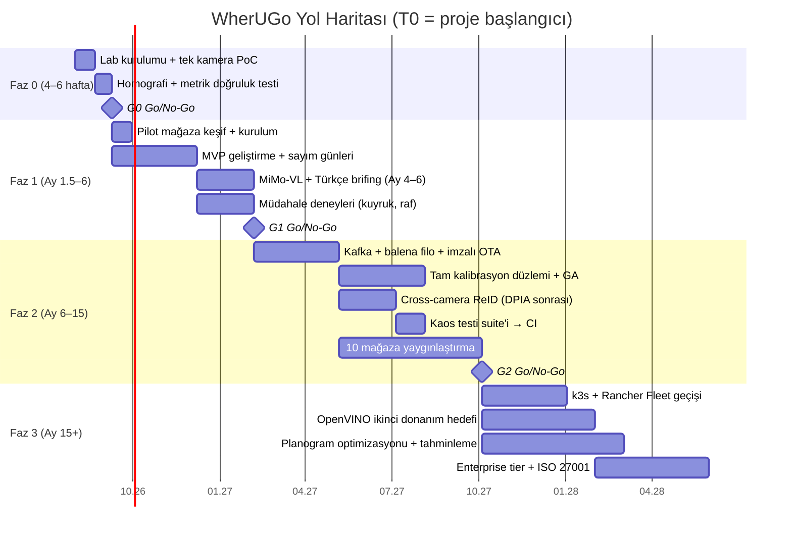

# Uygulama Yol Haritası

Yol haritası, jüri kararının temel ilkesini takvime çevirir: **pahalı-değiştirilen kararlar (Protobuf zarfı, RLS+gateway, kalite alanlı şema, reproj hatası kaydı) gün 1'de; pahalı-işletilen bileşenler (Kafka, K8s, cross-camera ReID, tam kalibrasyon düzlemi) kanıt kapılarının arkasında.** Her faz ölçülebilir bir go/no-go kapısıyla biter; kapı tutmazsa önceden tanımlı fallback devreye girer — mimari değişmez.

## Faz 0 — Teknik Doğrulama (4–6 hafta)

**Hedef:** Kritik teknik varsayımları sahada değil, labda kanıtla veya çürüt. Satış konuşmasına çıkmadan önce "mevcut CCTV ile bu doğruluk mümkün mü?" sorusunun cevabı elde olmalı.

**Teslimatlar:** Jetson Orin Nano Super üzerinde D-FINE-S INT8 TensorRT + ByteTrack (supervision) pipeline; go2rtc tek-çekiş restream + Frigate tarzı motion gating; 4 noktalı homografi kalibrasyon aracı (reproj hatası cm cinsinden metadata'ya yazılır); Protobuf olay zarfı v1 (`tenant_id … seq_no`); Mosquitto→EMQX→ClickHouse ince ingest iskeleti; tek kamera doğruluk raporu.

| Başarı kriteri | Eşik |
|---|---|
| Giriş sayımı (kontrollü test, top-down) | ≥%95 |
| Dwell MAPE (lab, kronometreye karşı) | ≤%15 |
| Homografi reproj hatası | ≤30 cm |
| Kapasite: 8 stream @10 FPS, tek Orin Nano Super | 24 saat kesintisiz, throttling yok |
| Uçtan uca olay kaybı (`seq_no` denetimi) | 0 |

**Ekip:** 1 CV/edge mühendisi (tam), 1 backend (yarı), kurucu/PM. **Efor:** ~10–14 adam-hafta. **Bütçe:** <$1.500 donanım (dev kit + 2 kamera + PoE switch).

## Faz 1 — Pilot Mağaza MVP (2–3 ay geliştirme; pilot Ay 6'ya kadar canlı, 1–2 mağaza)

**Hedef:** Tek mağazada ölçülebilir iş değeri kanıtla ve ücretli devam LOI'si al. Doğruluk iddiası satış tezidir; bu yüzden hafif ground-truth düzeni pilotta şarttır.

**DAHİL:** girişe 1–2 top-down dome (~$130/adet, zorunlu); footfall + occupancy (staff-excluded, BLE beacon ile); zone traffic + dwell (p50/p95); yoğunluk/dwell heatmap overlay (React + ECharts); kuyruk uzunluğu + "kasa aç" alarmı; POS günlük import → gerçek conversion; `coverage_gaps` + veri kalite rozeti; PG RLS + gateway `tenant_id` enjeksiyonu + k<10 bastırma; günlük sahne sağlık kontrolü; Ay 4'ten itibaren MiMo-VL olay-tetikli klip hakemi + Claude Haiku 4.5/Gemini Flash Türkçe günlük brifing (LiteLLM üzerinden).

**DAHİL DEĞİL:** Kafka, K8s, cross-camera ReID, RTMPose/pickup-putback, drift otomasyonu, GA'lı "±%X" metrikleri, REST API/webhook, persona görünümleri, Keycloak SSO, deck.gl, model fine-tune. (Şemadaki alanlar — `pickup/putback` enum, `calibration_run` — gün 1'de rezerve, boş durur.)

| Başarı kriteri | Eşik |
|---|---|
| Giriş sayımı (7 günlük manuel karşılaştırma) | ≥%90 |
| Dwell MAPE (sayım günü örneklemi) | ≤%15 |
| Edge uptime / kapsam boşluğu | ≥%98 / açık saatlerin ≤%2'si |
| Müdahale deneyleri (kuyruk alarmı → kasa açma; raf değişikliği diff-in-diff) | 2/2 pozitif, istatistiksel olarak raporlanmış |
| VLM A/B (200 klip, insan etiketli) | Bilgilendirme amaçlı — VLM açılış kararına girdi olur, G1 kapı kriteri değildir; kappa > 0.75 eşiği Faz 2'deki 1.000-klip testinde uygulanır (docs/03 §3.5) |
| Müdür dashboard kullanımı | ≥3 gün/hafta |
| Ticari | 1 ücretli devam LOI'si |

**Ekip:** 2 CV/edge, 1 backend, 1 frontend, 0.5 PM/satış + saha kurulum taşeronu. **Efor:** ~20 adam-ay.

### Pilot mağaza seçim kriterleri
1. Mevcut ONVIF/RTSP CCTV; keşifte substream, codec ve NVR stream-kilidi fiilen test edilir (kâğıt üstünde "ONVIF uyumlu" yetmez).
2. 8–12 kamera, tek ana giriş (sayım problemini basitleştirir), Orin Nano Super kapasitesinde. (13–20 kameralı bir aday mağaza ancak Orin NX 16GB box ile kabul edilir — docs/06 §6.2 profil tablosu.)
3. POS verisine günlük erişim (CSV/API) — conversion olmadan ROI hikâyesi kurulamaz.
4. Stabil internet (gereken bant <0,1 Mbps — Anadolu mağazası bile yeter) ve UPS'li ağ dolabı.
5. Mağaza müdürü sponsorluğu: haftalık 30 dk geri bildirim ve müdahale deneylerine katılım taahhüdü.
6. Diff-in-diff için eş profilli kontrol mağazası bulunabilmesi (aynı zincir, benzer trafik).
7. KVKK aydınlatma kiti kabulü, mahrem alan maskelerinin uygulanabilir yerleşimi, 6 ay içinde tadilat planı olmaması.

### Ground-truth doğrulama metodolojisi
Devreye almada ve sonrasında iki haftada bir **"sayım günü"** (2–4 saat): (a) iki bağımsız sayıcı el clicker'ı ile girişte sayar; uyuşmazlık video kaydından üçüncü sayımla çözülür; hata = |sistem − manuel| / manuel. (b) Dwell için ≥20 müşterilik kronometre örneklemi (zone bazlı, MAPE hesabı). (c) Kuyruk için 1 saatlik kasa gözlemi (uzunluk + bekleme). Sonuçlar `calibration_run` tablosuna `correction_factor + ci_low/ci_high + ground_truth_ref` olarak yazılır — Faz 2'deki GA'lı metriklerin hammaddesi bugünden birikir. Faz 2'den itibaren VLM ön-etiketli haftalık ~30 dk anotasyon bu yöntemin sürekli hali olur; tüm insan etiketlemede çift anotasyon + Cohen's kappa raporu.

## Faz 2 — Çoklu Mağaza + Dashboard + AI İçgörü (Ay 6–15; çekirdek geliştirme 3–4 ay, ardından yaygınlaştırma)

**Hedef:** 10 mağazada işletilebilirlik; "denetlenebilir doğruluk" farklılaştırıcısını ürünleştir.

**Teslimatlar:** EMQX→ClickHouse arasına Kafka (Protobuf sayesinde üreticilere görünmez); balenaCloud filo + imzalı OTA + %5 canary; BoT-SORT-ReID + OSNet-x0.25 cross-camera — **yalnız DPIA + KVKK uzman görüşü onayı ve ≥%80 eşleştirme kesinliği şartıyla**, altındaysa kamera-yerel kalınır; RTMPose + pickup/putback (funnel tamamlanır); tam kalibrasyon düzlemi (düzeltme katsayıları, %95 GA'lı "%12 ± 4" dili, PSI/KS drift testleri); bölge müdürü/merchandising persona görünümleri + fleet benchmark; REST API/webhook; MiMo anomali ön-açıklaması + fine-tune değerlendirmesi. **Kaos testi suite'i CI'a girer:** 48 saat kesinti, N-2 şemalı canary, saat kayması enjeksiyonu → "sıfır kayıp + doğru güne yazım + çift sayım yok".

| Başarı kriteri | Eşik |
|---|---|
| Canlı mağaza / churn | 10 mağaza, ≥2 tenant / churn 0 |
| Kaos suite | CI'da yeşil, her release'te |
| Cross-camera eşleştirme kesinliği | ≥%80 (yoksa zone-bazlı mod) |
| VLM-insan uyumu (1.000-klip A/B, çift anotasyon) | Cohen's kappa > 0.75 (altında VLM yalnız ön-filtre olur — docs/03 §3.5) |
| OTA canary → tam dağıtım | <48 saat, rollback <15 dk |
| Kalibre metrik kapsamı | Ana 5 metrikte GA raporlaması |
| Operasyon | Mağaza başına aylık müdahale ≤1 saha ziyareti |
| Ticari | ≥$300/mağaza/ay ortalama MRR |

**Ekip:** Faz 1 çekirdeği + 1 data engineer, + 1 SRE/MLOps, + KVKK danışmanı (DPIA), + 0.5 müşteri başarı. **Efor:** ~45–55 adam-ay.

## Faz 3 — Ölçek, Planogram Optimizasyonu, Tahminleme (Ay 15+, ilk dalga 6+ ay)

**Hedef:** 100+ mağaza; ürünü "ölçüm"den "reçete"ye taşı.

**Teslimatlar:** balena maliyet eğrisi kırılınca k3s + Rancher Fleet; Intel/OpenVINO ikinci donanım hedefi (heterojen envanter); NVIDIA sahalarında DeepStream+MV3DT opsiyonu; **planogram optimizasyon modülü** — kontrol mağazalı diff-in-diff A/B (sektör bandı: kategori satışında +%12–20), kategori komşuluğu/cross-merch önerisi; **tahminleme** — trafik tahmini + vardiya önerisi (referans: trafik-bazlı staffing ile dönüşüm +%4,5), kuyruk terki ₺ raporu; X-CLIP→VideoMAE cascade (klip hacmi MiMo maliyetini aşınca); Claude Sonnet 5 "konuşan dashboard"; enterprise dedicated tier + Keycloak SSO + tam audit; ISO 27001.

| Başarı kriteri | Eşik |
|---|---|
| Ölçek | 100+ mağaza, ≥5 tenant |
| Şema/sözleşme kırılması | 0 (Protobuf + gateway gün 1 kararının testi) |
| Birim ekonomi | Cihaz başına aylık bulut+filo OPEX ≤$3 |
| Planogram modülü | ≥3 müşteride ölçülmüş pozitif A/B |
| Ticari | NRR ≥%110, ISO 27001 sertifikası |

**Ekip:** ~10–14 kişi (platform, edge, data/ML, 2× saha ops, satış/CS). **Efor:** ilk dalga ~70–90 adam-ay.

## Go/No-Go Karar Noktaları

| Kapı | Zaman | Kriter | No-Go aksiyonu |
|---|---|---|---|
| **G0** | Faz 0 sonu | Faz 0 tablosundaki 5 eşik | Sayım/dwell tutmazsa: top-down dome fallback + 2 hafta yeniden test; hâlâ tutmazsa açılı-kamera-reuse tezi düşer, "seçici kamera paketi" birincil modele döner veya dur kararı |
| **G1** | Ay 6 | Giriş ≥%90, dwell MAPE ≤%15, 2 pozitif müdahale, ücretli LOI | Doğruluk tamam ama LOI yoksa: fiyat/segment pivotu, 3 ay ek satış penceresi; doğruluk tutmuyorsa Faz 2'ye geçilmez |
| **G2a** (ara) | Cross-camera öncesi | DPIA + KVKK görüşü + ≥%80 eşleştirme | Embedding'siz zone-bazlı mod (mimaride hazır B planı) |
| **G2** | Ay 15 | Kaos suite yeşil, churn 0, MRR eşiği, operasyon ≤1 ziyaret/ay | Ölçek yatırımı ertelenir; 10 mağazada kârlılık optimize edilir |

Her kapıda karar girdisi aynı üçlüdür: **doğruluk verisi (ground-truth raporları), operasyon verisi (uptime/coverage_gaps), ticari sinyal (kullanım + ödeme istekliliği).** Kapılar takvimle değil kanıtla açılır — takvim hedefi kaçarsa faz uzar, kapı kriteri asla sulandırılmaz.
