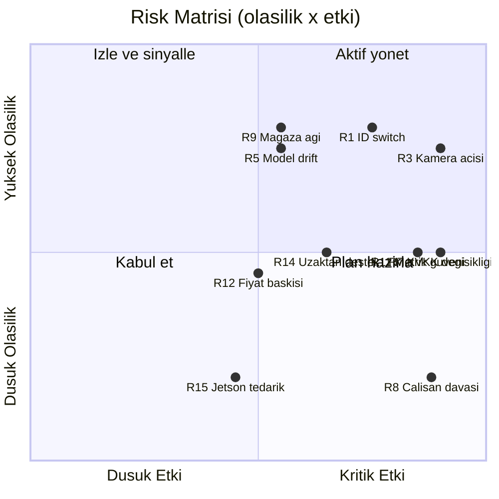

# 8. Riskler ve Açık Sorular

Bu bölüm, mimari kararların (bkz. Bölüm 2–5) bilinçli olarak taşıdığı riskleri kayıt altına alır. İlke: her risk için **erken sinyal** üretimde ölçülebilir bir metriğe bağlanır — risk yönetimi sezgiyle değil, `device_health`, `coverage_gaps` ve kalite rozetiyle yapılır.

## 8.1 Risk Kayıt Tablosu

| # | Risk | Kategori | Olasılık | Etki | Erken Sinyal | Azaltma Planı |
|---|---|---|---|---|---|---|
| R1 | Kalabalık saatlerde **ID switch** — dwell/funnel metriklerini bozar | Teknik | Yüksek | Yüksek | `quality.id_switch_risk` ortalamasının yoğun saatlerde >0.3'e çıkması; dwell p95'te açıklanamayan sıçramalar | ByteTrack ikinci-aşama eşleme + Frigate motion gating; olay bazında `id_switch_risk` alanı sayesinde şüpheli olaylar metrikten düşülür/rozetlenir; Faz 2'de ReID'li tracker (BoT-SORT-ReID, MOT20 lideri) yalnız kanıtlanmış ihtiyaçta |
| R2 | **Işık koşulları** (vitrin karşı ışığı, akşam aydınlatması, yansımalı zemin) tespit doğruluğunu düşürür | Teknik | Orta | Orta | Günlük sahne sağlık kontrolünde blur/aydınlatma sapması bayrağı; saat-bazlı `conf` dağılımında sistematik düşüş | Kurulumda saat-bazlı test kaydı; D-FINE fine-tune setine düşük-ışık kareler; düzelmeyen kameralarda pozisyon/pozlama değişikliği veya dome önerisi |
| R3 | Mevcut CCTV'nin **açısı/çözünürlüğü giriş sayımı için yetersiz** — sayım POS-dönüşümün temelidir | Teknik | Yüksek | Kritik | Devreye alma "sayım günü"nde giriş sayımı <%90; homografi reproj hatası >30 cm | Mimari karar gereği girişlere top-down dome **pilotta zorunlu** (~$130/adet); dome fallback fiyat listesinde "seçici kamera paketi" olarak ürünleşmiş durumda — mimari değişmez |
| R4 | **Cross-camera Re-ID doğruluğu** düşük kalır (tepe açı + Türkiye kıyafet dağılımında SOTA modellerde %38–51 mAP düşüşü raporlanmış) | Teknik | Orta | Orta | Faz 2 ön-testinde eşleştirme kesinliği <%80 | Faz kapısı zaten koşullu: <%80'de kamera-yerel modda kalınır; embedding'siz zone-bazlı journey B planı mimaride hazır; OSNet-x0.25 + sahadan fine-tune |
| R5 | **Model drift** — sezonluk kıyafet, mağaza tadilatı, raf değişimi sonrası doğruluk sessizce erir | Teknik | Yüksek | Orta | Haftalık örnekleme anotasyonunda MAPE artışı; homografi drift bayrağı; `conf` dağılımı kayması | Gün 1'de sahne sağlık kontrolü + kalibrasyon süresi dolunca **kırmızı rozet** (satışa yansıyan görünür sinyal); Faz 2'de PSI/KS drift testleri + yeniden kalibrasyon otomasyonu |
| R6 | **VLM halüsinasyonu** — MiMo `vlm_verdict`'in yanlış sınıflandırması brifinge sızarsa güven kaybı | Teknik | Orta | Orta | A/B'de Cohen's kappa <0.75; insan onay oranında düşüş | VLM çıktısı yalnız *öneri*; her sayısal iddiaya kaynak metrik ID'si; kappa eşiği tutmazsa VLM yalnız ön-filtre rolüne çekilir (karar §5'te fiyatlanmış) |
| R7 | **KVKK karar/içtihat değişikliği** — Kurul'un kamera analitiğini daraltan yeni ilke kararı (2026/921 ve 06/2026 duyurusu trendin sertleştiğini gösteriyor) | Hukuki | Orta | Kritik | Kurul gündem/duyuru takibinde perakende analitiğine dair yeni karar; müşteri hukuk ekiplerinden artan soru hacmi | Çeyreklik Kurul karar takibi (docs/05 §5.3 uyum kontrol listesi); mimari zaten en muhafazakâr yorumla kurulu (yüz tanıma yok, video mağazadan çıkmaz, k<10 bastırma); cross-camera ReID **DPIA + uzman görüşü kapısının** arkasında |
| R8 | **Çalışan davası** — "etkileşim analizi" bireysel performans izleme sayılır (haklı fesih + KVKK cezası riski, ceza tavanı 17.092.242 TL) | Hukuki | Düşük | Kritik | Müşteri mağazasında çalışan temsilcisi itirazı; aydınlatma tebliğ tutanaklarının eksikliği | Şema düzeyinde imkânsızlık: DB'de bireysel çalışan tablosu **yok**, yalnız vardiya/mağaza agregatı; staff exclusion BLE/üniforma ile (biyometrik değil); çalışan aydınlatma + tebliğ tutanağı şablonu ürün paketinde; sözleşmeye "bireysel skor üretilmez" taahhüdü |
| R9 | Mağaza **ağ altyapısı zayıflığı** — kesintili uplink, NAT arkası erişimsizlik, düşük bant | İş | Yüksek | Orta | `coverage_gaps` tablosunda cause=network kayıtlarının artışı; heartbeat boşlukları | Mosquitto store-and-forward (48 saat kesinti kaos testi Faz 2 CI'ında); buluta yalnız ~<50 MB/gün metadata (~2.000× bant tasarrufu); kurulum öncesi ağ anketi (checklist); gerekirse 4G yedek dongle opsiyonu |
| R10 | **Kurulum maliyeti direnci** — "mevcut kamera yeter" beklentisindeki müşteri dome + Jetson CAPEX'ine itiraz eder | İş | Orta | Orta | POC tekliflerinde CAPEX satırına itiraz oranı; satış döngüsünün uzaması | Donanımsız-ağırlıklı anlatı korunur (CCTV birincil yol); dome yalnız girişte ve doğruluk garantisinin şartı olarak sunulur; kamera-başı/ay SaaS fiyatına CAPEX amortismanı gömülebilir (kiralama modeli) |
| R11 | **Metriklere güvensizlik** — müdür "bu sayılar yanlış" derse ürün ölür (sektörde %95+ doğruluk garantisi norm: RetailFlux, Ipsos) | İş | Orta | Kritik | Dashboard kullanım sıklığında düşüş; destek taleplerinde "sayı tutmuyor" teması | Ana farklılaştırıcımız tam bu: devreye almada 2–4 saat ground-truth "sayım günü", kalite rozeti, `coverage_gaps` ("veri yok ≠ müşteri yok"), Faz 2'de "%12 ± 4" güven aralığı dili; kapı kriteri giriş ≥%90 / dwell MAPE ≤%15 tutmadan ölçek yok |
| R12 | **Rakip fiyat baskısı** — V-Count/sayaç oyuncuları $20–100/sensör/ay bandını aşağı çeker; "ucuz sayaç yeter" algısı | İş | Orta | Orta | Kaybedilen tekliflerde fiyat gerekçesi; rakip fiyat listesi değişimleri | Sayaçla değil **journey + funnel + ₺ dili** ile rekabet (sayaçların veremediği kuyruk terki cirosu, planogram diff-in-diff); KVKK-native denetlenebilir doğruluk hikâyesi; giriş fiyatı TR bandında ($15–40/kamera/ay) |
| R13 | **Kenar cihaz arızaları** — Jetson termal/SD kart/PSU arızası; mağazada teknik personel yok | Operasyonel | Orta | Orta | `device_health` temp/decode_fps anomalileri; heartbeat kaybı | Gün 1'de device_health telemetrisi + alarm; endüstriyel eMMC/NVMe (SD kart yok), fansız kasada termal test; yedek cihaz stoğu (%5); Faz 2'de balenaCloud + imzalı OTA + %5 canary ile filo sağlığı |
| R14 | **Uzaktan destek yetersizliği** — saha müdahalesi gerektiren her arıza pilotta ekibi, ölçekte marjı yer | Operasyonel | Orta | Yüksek | Cihaz başına aylık saha ziyareti >0.2; ortalama çözüm süresinin artması | Uzaktan erişim (mTLS ters tünel) gün 1'de; kurulum sihirbazı + self-servis sağlık sayfası; kargoyla cihaz değişimi ("swap-and-ship") operasyon modeli; Faz 3'te yerel bayi/partner ağı |
| R15 | **Jetson tedarik/fiyat riski** — Orin serisi tedarik dalgalanması ölçekleme takvimini bozar | Operasyonel | Düşük | Orta | Distribütör teslim sürelerinin >8 haftaya çıkması | Tracker/zone mantığı supervision ile framework-bağımsız yazıldı; Faz 3'te Intel/OpenVINO ikinci donanım hedefi zaten planda — öne çekilebilir |

## 8.2 Açık Sorular

Kararlaştırılması gereken, mimarinin bilinçli olarak açık bıraktığı konular:

| # | Soru | Karar vericisi | Son karar noktası |
|---|---|---|---|
| S1 | Pilot mağaza segmenti: süpermarket mi, giyim mi? (Kuyruk analitiği markette, dwell/planogram giyimde daha değerli — kapı kriterlerinin ağırlığı değişir) | Kurucu ekip + ilk müşteri LOI'si | Pilot sözleşmesi öncesi |
| S2 | Dome kamera CAPEX'i kim öder — müşteri mi, kiralama modeliyle WherUGo mu? | Kurucu ekip (fiyatlama) | İlk teklif şablonu |
| S3 | Cross-camera ReID Faz 2'de gerçekten açılacak mı — DPIA + uzman görüşü + %80 kesinlik üç şartı birden sağlanmazsa zone-bazlı modda kalıcı mı kalınır? | Hukuk danışmanı (DPIA) + CTO (kesinlik ölçümü) | Faz 2 başlangıcı, Ay 6–9 |
| S4 | POS entegrasyonu pilot müşteride hangi yöntemle: günlük CSV import mu, gerçek zamanlı API mi? (`pos_daily` şeması ikisini de taşır) | Pilot müşteri IT'si + backend lead | Kurulum haftası |
| S5 | TR veri yerleşimli bulut sağlayıcı seçimi (tek VM pilotu için) ve Faz 3 managed ClickHouse çıkış yolu | CTO | Pilot kurulumu öncesi |
| S6 | Türkçe brifing modeli: Claude Haiku 4.5 mü Gemini Flash mi? (LiteLLM sayesinde geç karar mümkün; maliyet ~$0,15–0,60/gün/mağaza) | ML lead, 200 klip A/B sonrası | Ay 4–6 |
| S7 | Qwen3-VL-8B A/B'si kappa >0.75'i geçerse MiMo'dan geçiş yapılır mı, yoksa çift-model mi tutulur? | ML lead | Faz 2 |
| S8 | Çalışan temsilcisi/sendika bilgilendirmesi zincir müşterilerde kimin süreci — WherUGo şablon mu verir, süreci de mi yönetir? | Hukuk danışmanı + satış | İlk zincir müşterisi |
| S9 | k-anonimlik eşiği k=10 mu kalır, küçük mağazalarda (günde <200 ziyaretçi) k=5'e mi iner? | DPO/hukuk + ürün | Pilot verisiyle, Ay 3 |

## 8.3 Varsayımlar ve Test Planı

| Varsayım | Nasıl test edilir | Yanlışsa ne olur |
|---|---|---|
| Tek Orin Nano Super 8–12 kamera @10 FPS'i taşır (D-FINE-S INT8 + ByteTrack + motion gating) | Pilot kurulumda `device_health.det_fps` 2 hafta izlenir; hedef: yoğun saatte kamera başına ≥8 FPS | Kamera sayısı 6'ya düşürülür veya Orin NX 16GB'a erken geçilir (bütçe farkı fiyata yansır) |
| Mevcut CCTV'lerin ≥%70'i (açı/çözünürlük olarak) zone analitiği için yeterli | Kurulum sihirbazındaki sahne sağlık kontrolü her kamerayı geçer/kalır puanlar; ilk 2 mağazada oran ölçülür | "Seçici kamera paketi" satış payı artar; birim ekonomisi güncellenir |
| Dwell MAPE ≤%15 satış tezi için yeterli hassasiyettir (müşteri bunu "doğru" algılar) | Pilot müşterisiyle yapılandırılmış geri bildirim + iki müdahale deneyinin (kuyruk alarmı, raf diff-in-diff) iş sonucu | Kalibrasyon düzlemi (Faz 2) öne çekilir; güven aralığı dili erken açılır |
| Anonim metadata + k<10 bastırma + agregat çalışan metriği kombinasyonu KVKK m.5/2-f meşru menfaatle savunulabilir | Pilot öncesi LIA belgesi + KVKK uzmanı görüşü; cross-camera öncesi DPIA | Etkilenen özellik (ör. journey) kapatılır, sayım+zone çekirdeği yaşar — mimari katmanlı olduğu için ürün ölmez |
| Mağaza müdürü günlük Türkçe brifingi okur ve aksiyon alır (dashboard değil ajan tezi) | Ay 4–6'da brifing açılış/aksiyon oranı ölçülür; A/B: brifingli vs brifingsiz hafta | Brifing haftalığa düşürülür, bütçe kuyruk alarmı gibi push-aksiyonlara kayar |
| MiMo ön-etiketleme insan anotasyonunu ≥5× hızlandırır (kalibrasyon düzleminin ekonomisi buna dayalı) | 200 klip pilotunda etiket/saat ölçümü: VLM-önerili vs sıfırdan | İnsan anotasyon maliyeti fiyatlamaya girer (karar §5'te öngörülmüş) |
| Pilot müşteri ölçülebilir değer görünce ücretli devama geçer (LOI kapı kriteri) | Ay 5'te LOI görüşmesi; iki müdahale deneyinin ₺ etkisi sunumla | Segment/persona hipotezi revize edilir; Faz 2 yatırımı ertelenir |

**Kapanış notu:** R3, R7, R8 ve R11 "kritik etki" sınıfındadır ve dördü de mimaride önden fiyatlanmıştır (zorunlu dome, muhafazakâr gizlilik tasarımı, şema düzeyinde çalışan koruması, kalite rozeti + ground-truth günü). Kalan risklerin tamamı erken sinyal metriğine bağlıdır; sinyali olmayan risk bu tabloya eklenmez — eklenmek isteniyorsa önce ölçümü tanımlanır.
